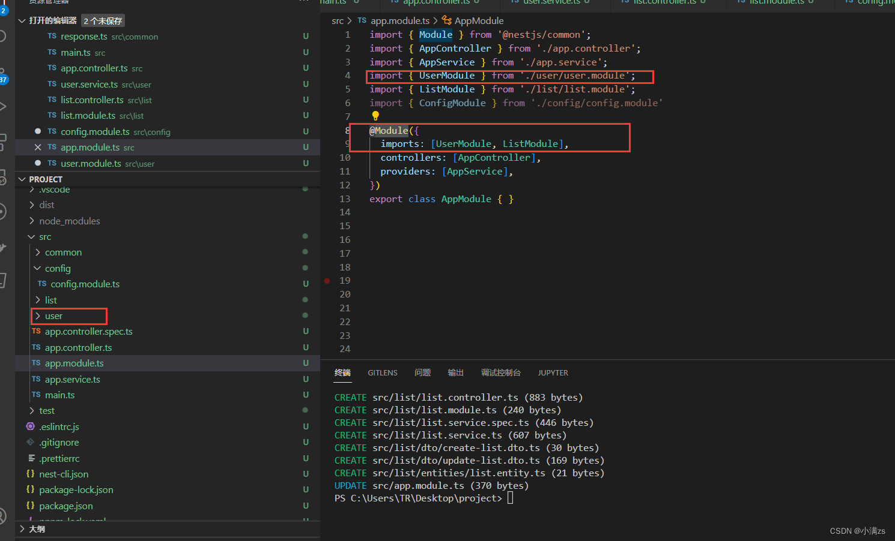
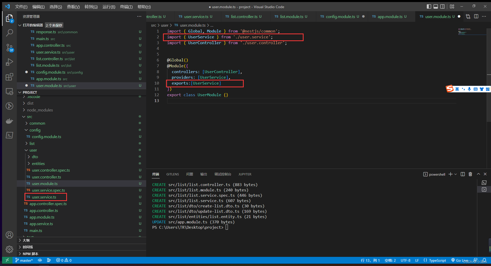
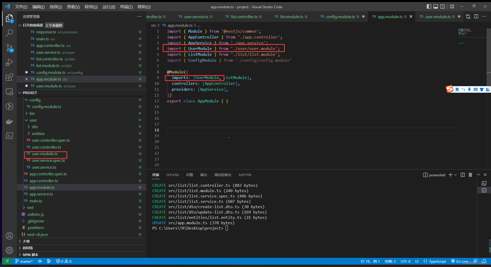
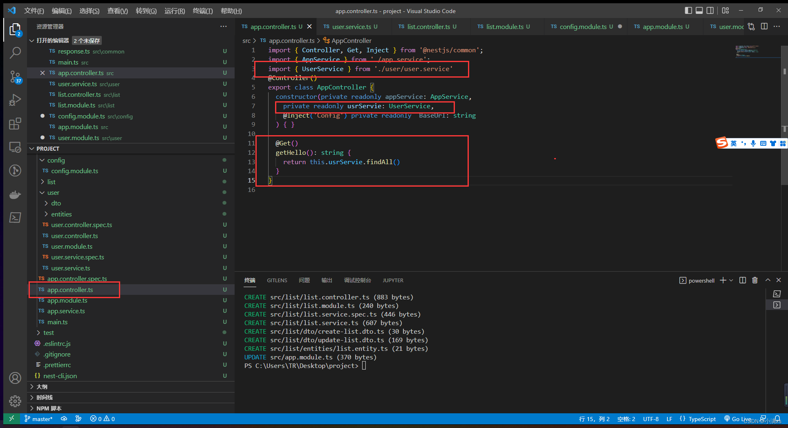
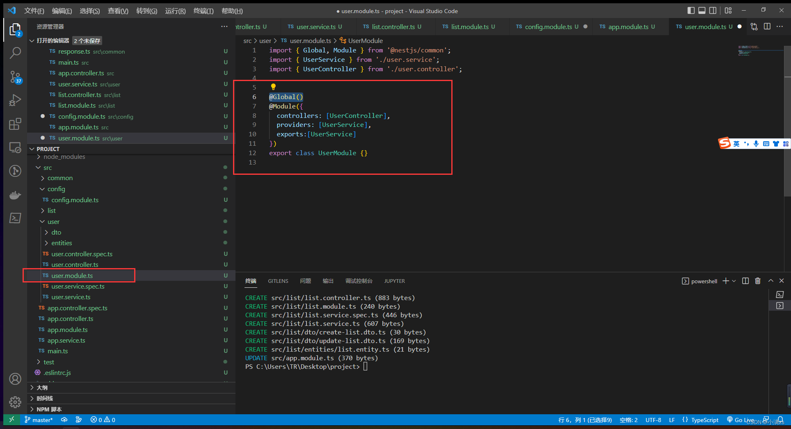

### 模块@Module

每个 Nest 应用程序至少有一个模块，即根模块。根模块是 Nest 开始安排应用程序树的地方。
事实上，根模块可能是应用程序中唯一的模块，特别是当应用程序很小时，但是对于大型程序来说这是没有意义的。
在大多数情况下，您将拥有多个模块，每个模块都有一组紧密相关的功能

1. 基本用法
   当我们使用 nest g res user 创建一个 CURD 模板的时候 nestjs 会自动帮我们引入模块
   

2. 共享模块
   例如 user 的 Service 想暴露给 其他模块使用就可以使用 exports 导出该服务
   

由于 App.modules 已经引入过该模块 就可以直接使用 user 模块的 Service

3. 全局模块
   @Global()
   我们给 user 模块添加 @Global() 他便注册为全局模块
   
   在 list 模块使用无须在 module import 导入
   .png>)

4. 动态模块
   动态模块主要就是为了给模块传递参数 可以给该模块添加一个静态方法 用来接受参数
