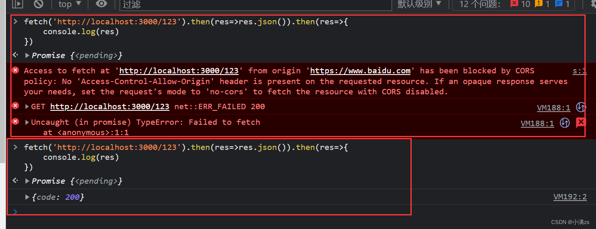

```sh
  nest g mi/middleware logger
```

### 1.创建一个依赖注入中间件

1. 要求我们实现 use 函数 返回 req res next 参数 如果不调用 next 程序将被挂起

```ts
// src/middleware/index.ts
import { Injectable, NestMiddleware } from "@nestjs/common";
import { Request, Response, NextFunction } from "express";
@Injectable()
export class Logger implements NestMiddleware {
  use(req: Request, res: Response, next: NextFunction) {
    console.log(req);
    next();
  }
}
```

2. 使用方法 在模块里面 实现 configure 返回一个消费者 consumer 通过 apply 注册中间件 通过 forRoutes 指定 Controller 路由

```ts
// user.module.ts
import { Module, NestModule, MiddlewareConsumer, RequestMethod } from "@nestjs/common";
import { UserService } from "./user.service";
import { UserController } from "./user.controller";
import { Logger } from "src/middleware";
@Module({
  controllers: [UserController],
  providers: [UserService],
  exports: [UserService],
})
export class UserModule implements NestModule {
  configure(consumer: MiddlewareConsumer) {
    // forRoutes('user') user是 user.controller.ts 的路由
    consumer.apply(Logger).forRoutes("user");
    // 也可以指定 拦截的方法 比如拦截GET  POST 等 forRoutes 使用对象配置
    consumer.apply(Logger).forRoutes({ path: "user", method: RequestMethod.GET });
    // 你甚至可以直接吧 UserController 塞进去， 这样会拦截所有的请求
    consumer.apply(Logger).forRoutes(UserController);
  }
}
```

### 2.全局中间件

注意全局中间件只能使用函数模式 案例可以做白名单拦截之类的

```ts
// main.ts
import { NestFactory } from "@nestjs/core";
import { AppModule } from "./app.module";
import { Request, Response, NextFunction } from "express";

const whiteList = ["/list"];

function middleWareAll(req: Request, res: Response, next: NextFunction) {
  console.log(req.originalUrl, "我收全局的");

  if (whiteList.includes(req.originalUrl)) {
    next();
  } else {
    res.send("小黑子露出鸡脚了吧");
  }
}

async function bootstrap() {
  const app = await NestFactory.create(AppModule);
  app.use(middleWareAll);
  await app.listen(3000);
}
bootstrap();
```

### 3.接入第三方中间件 例如 cors 处理跨域

```ts
import { NestFactory } from "@nestjs/core";
import { AppModule } from "./app.module";
import * as cors from "cors";

const whiteList = ["/list"];

function middleWareAll(req, res, next) {
  console.log(req.originalUrl, "我收全局的");

  if (whiteList.includes(req.originalUrl)) {
    next();
  } else {
    res.send({ code: 200 });
  }
}

async function bootstrap() {
  const app = await NestFactory.create(AppModule);
  app.use(cors());
  app.use(middleWareAll);
  await app.listen(3000);
}
bootstrap();
```


