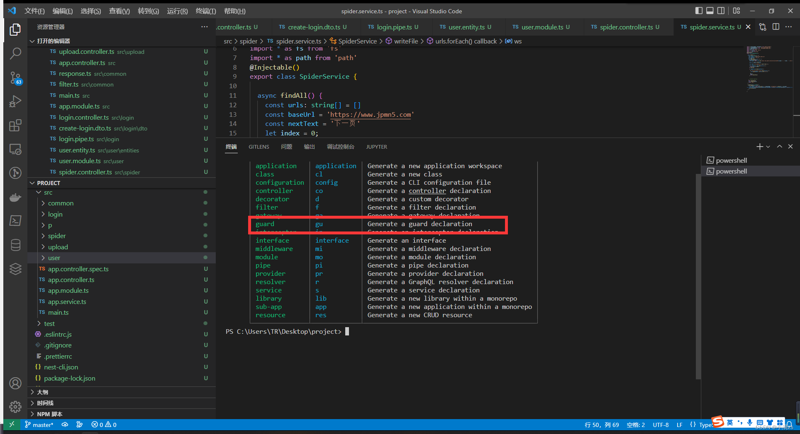
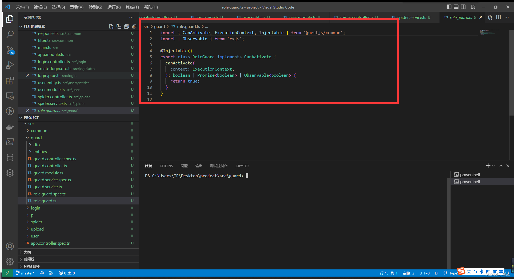
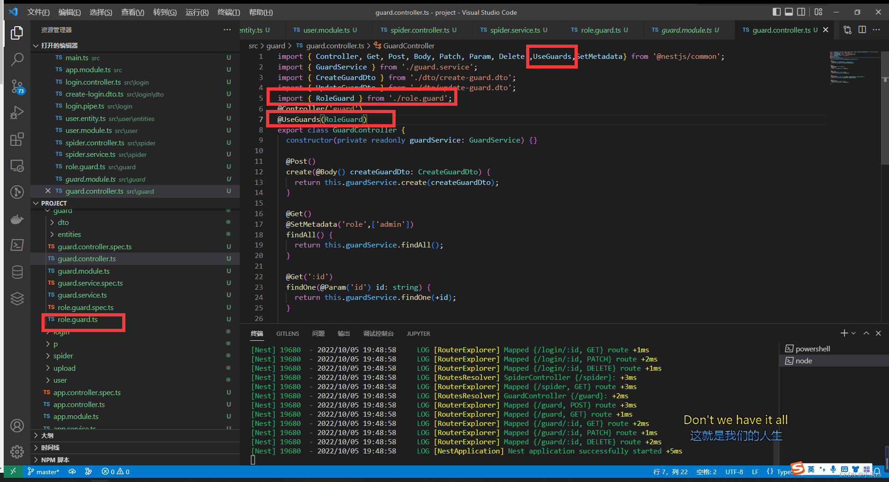
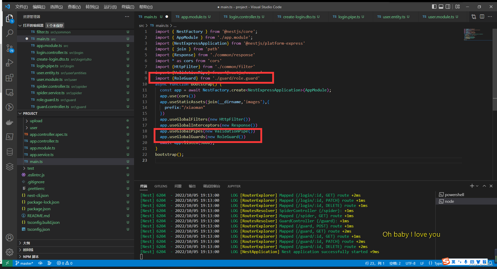
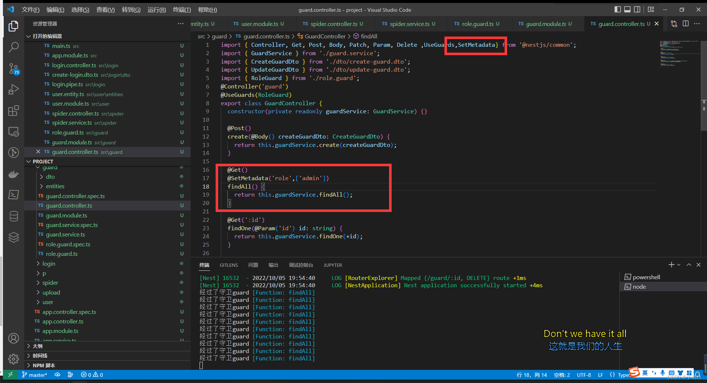
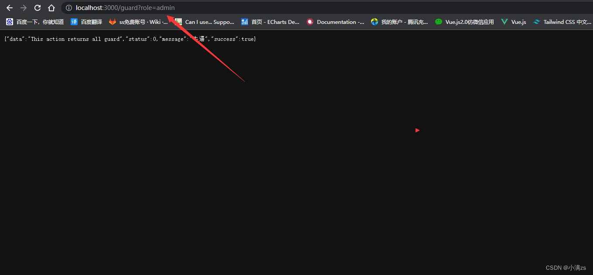
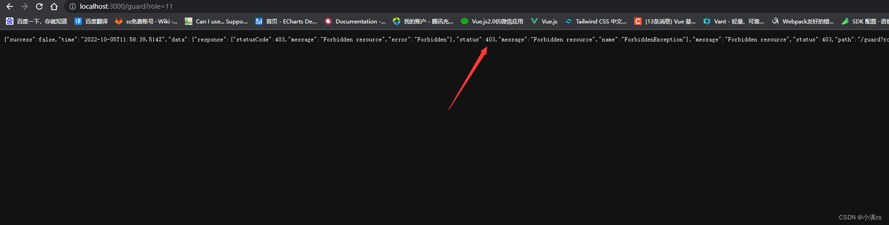

### 守卫（guard）

守卫有一个单独的责任。
它们根据运行时出现的某些条件（例如权限，角色，访问控制列表等）来确定给定的请求是否由路由处理程序处理。
这通常称为授权。在传统的 Express 应用程序中，通常由中间件处理授权(以及认证)。
中间件是身份验证的良好选择，因为诸如 token 验证或添加属性到 request 对象上与特定路由(及其元数据)没有强关联。

<tip>tips 守卫在每个中间件之后执行，但在任何拦截器或管道之前执行。</tip>

1. 创建一个守卫

```sh
  nest -h
  nest g gu [name]
```



守卫要求实现函数 给定参数 context 执行上下文 要求返回布尔值


2. Controller 使用守卫

使用 UseGuards 控制守卫


3. 全局守卫

```ts
app.useGlobalGuards(new RoleGuard());
```



4.  针对角色控制守卫
    SetMetadata 装饰器
    第一个参数为 key，第二个参数自定义我们的例子是数组存放的权限
    

guard 使用 Reflector 反射读取 setMetaData 的值 去做判断这边例子是从 url 判断有没有 admin 权限

```ts
import { CanActivate, ExecutionContext, Injectable } from "@nestjs/common";
import { Observable } from "rxjs";
import { Reflector } from "@nestjs/core";
import type { Request } from "express";
@Injectable()
export class RoleGuard implements CanActivate {
  constructor(private Reflector: Reflector) {}
  canActivate(context: ExecutionContext): boolean | Promise<boolean> | Observable<boolean> {
    const admin = this.Reflector.get<string[]>("role", context.getHandler());
    const request = context.switchToHttp().getRequest<Request>();
    if (admin.includes(request.query.role as string)) {
      return true;
    } else {
      return false;
    }
  }
}
```


成功的 


失败的
