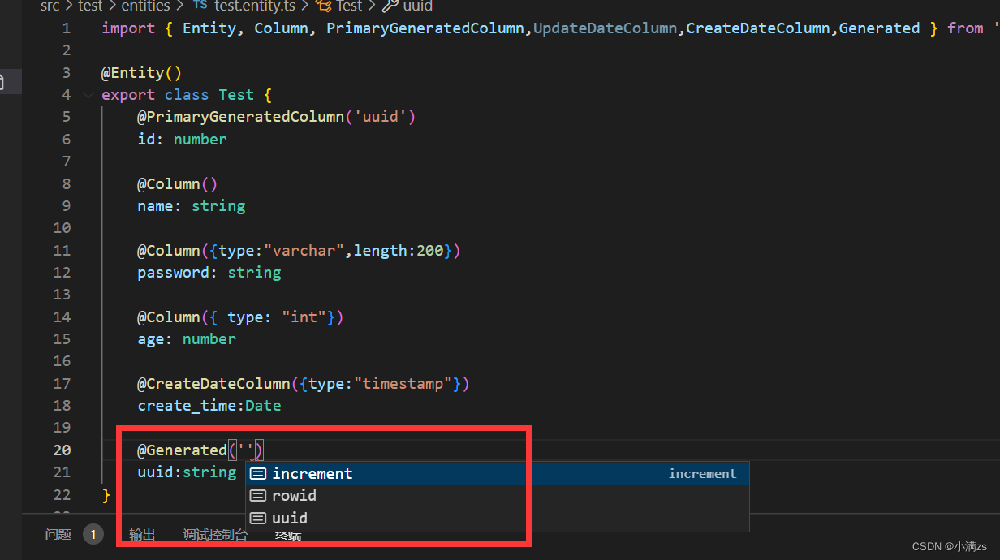

### 什么是实体

实体是一个映射到数据库表的类。 你可以通过定义一个新类来创建一个实体，并用@Entity()来标记; 这样会自动帮你在数据库中创建一个 test 表

```ts
// test.entity.ts
import { Entity, Column, PrimaryGeneratedColumn } from "typeorm";

@Entity()
export class Test {
  @PrimaryGeneratedColumn()
  id: number;

  @Column()
  name: string;

  @Column()
  password: string;

  @Column()
  age: number;
}
```

### 主列

自动递增的主键

```ts
@PrimaryGeneratedColumn()
id:number
```

### 自动递增 uuid

自动递增的主键

```ts
@PrimaryGeneratedColumn("uuid")
id:number
```

### 列类型

```ts
export class Test {
  @Column({ type: "varchar", length: 200 })
  password: string;

  @Column({ type: "int" })
  age: number;

  @CreateDateColumn({ type: "timestamp" })
  create_time: Date;
}
```

### mysql 所有类型

int, tinyint, smallint, mediumint, bigint, float, double, dec, decimal, numeric, date, datetime, timestamp, time, year, char, varchar, nvarchar, text, tinytext, mediumtext, blob, longtext, tinyblob, mediumblob, longblob, enum, json, binary, geometry, point, linestring, polygon, multipoint, multilinestring, multipolygon, geometrycollection

### 自动生成列

```ts
@Generated('uuid')
uuid:string
```

### 枚举列

```ts
  @Column({
    type:"enum",
    enum:['1','2','3','4'],
    default:'1'
  })
  xx:string
```



### 列选项

```ts
    @Column({
        type:"varchar",
        name:"ipaaa", //数据库表中的列名
        nullable:true, //在数据库中使列NULL或NOT NULL。 默认情况下，列是nullable：false
        comment:"注释",
        select:true,  //定义在进行查询时是否默认隐藏此列。 设置为false时，列数据不会显示标准查询。 默认情况下，列是select：true
        default:"xxxx", //加数据库级列的DEFAULT值
        primary:false, //将列标记为主要列。 使用方式和@ PrimaryColumn相同。
        update:true, //指示"save"操作是否更新列值。如果为false，则只能在第一次插入对象时编写该值。 默认值为"true"
        collation:"", //定义列排序规则。
    })
    ip:string
```

## Column 的配置项中可用选项列表：

1. type: ColumnType - 列类型。其中之一在上面.
2. name: string - 数据库表中的列名。
   默认情况下，列名称是从属性的名称生成的。 你也可以通过指定自己的名称来更改它。

3. length: number - 列类型的长度。 例如，如果要创建 varchar（150）类型，请指定列类型和长度选项。
4. width: number - 列类型的显示范围。 仅用于 MySQL integer types(opens new window)
5. onUpdate: string - ON UPDATE 触发器。 仅用于 MySQL (opens new window).
6. nullable: boolean - 在数据库中使列 NULL 或 NOT NULL。 默认情况下，列是 nullable：false。
7. update: boolean - 指示"save"操作是否更新列值。如果为 false，则只能在第一次插入对象时编写该值。 默认值为"true"。
8. select: boolean - 定义在进行查询时是否默认隐藏此列。 设置为 false 时，列数据不会显示标准查询。 默认情况下，列是 select：true
9. default: string - 添加数据库级列的 DEFAULT 值。
10. primary: boolean - 将列标记为主要列。 使用方式和@ PrimaryColumn 相同。
11. unique: boolean - 将列标记为唯一列（创建唯一约束）。
12. comment: string - 数据库列备注，并非所有数据库类型都支持。
13. precision: number - 十进制（精确数字）列的精度（仅适用于十进制列），这是为值存储的最大位数。仅用于某些列类型。
14. scale: number - 十进制（精确数字）列的比例（仅适用于十进制列），表示小数点右侧的位数，且不得大于精度。 仅用于某些列类型。
15. zerofill: boolean - 将 ZEROFILL 属性设置为数字列。 仅在 MySQL 中使用。 如果是 true，MySQL 会自动将 UNSIGNED 属性添加到此列。
16. unsigned: boolean - 将 UNSIGNED 属性设置为数字列。 仅在 MySQL 中使用。
17. charset: string - 定义列字符集。 并非所有数据库类型都支持。
18. collation: string - 定义列排序规则。
19. enum: string[]|AnyEnum - 在 enum 列类型中使用，以指定允许的枚举值列表。 你也可以指定数组或指定枚举类。
20. asExpression: string - 生成的列表达式。 仅在 MySQL (opens new window)中使用。
21. generatedType: "VIRTUAL"|"STORED" - 生成的列类型。 仅在 MySQL (opens new window)中使用。
22. hstoreType: "object"|"string" -返回 HSTORE 列类型。 以字符串或对象的形式返回值。 仅在 Postgres 中使用。
23. array: boolean - 用于可以是数组的 postgres 列类型（例如 int []）
24. transformer: { from(value: DatabaseType): EntityType, to(value: EntityType): DatabaseType } - 用于将任意类型 EntityType 的属性编组为数据库支持的类型 DatabaseType。

### simple-array 列类型

有一种称为 simple-array 的特殊列类型，它可以将原始数组值存储在单个字符串列中。 所有值都以逗号分隔

```ts
@Entity()
export class User {
  @PrimaryGeneratedColumn()
  id: number;

  @Column("simple-array")
  names: string[];
}
```

### simple-json 列类型

还有一个名为 simple-json 的特殊列类型，它可以存储任何可以通过 JSON.stringify 存储在数据库中的值。 当你的数据库中没有 json 类型而你又想存储和加载对象，该类型就很有用了。 例如:

```ts
@Entity()
export class User {
  @PrimaryGeneratedColumn()
  id: number;

  @Column("simple-json")
  profile: { name: string; nickname: string };
}
```
