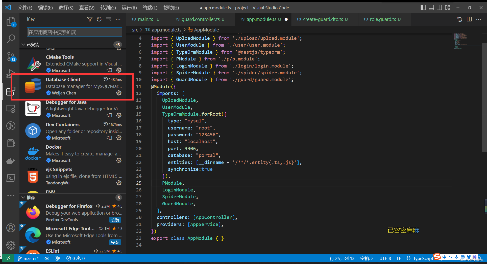
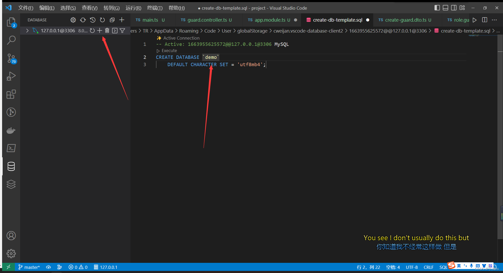
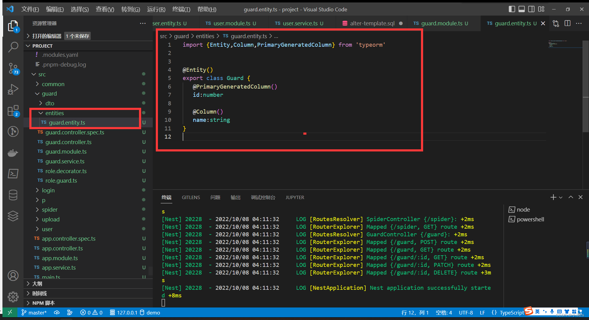
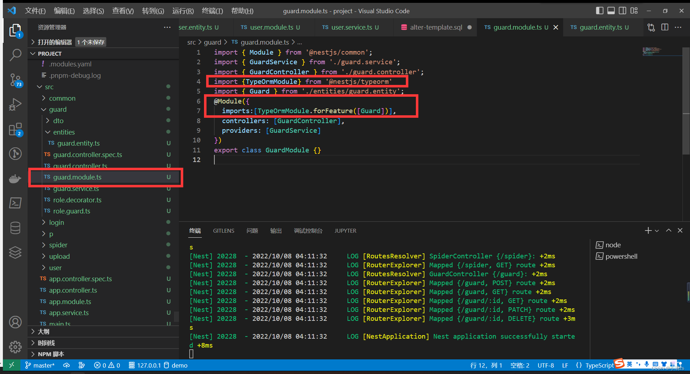

1. 安装 mysql
   <a href="https://www.bilibili.com/read/cv18753383/?spm_id_from=333.999.0.0">安装《MySql8.0 保姆级》 - 哔哩哔哩</a>

2. ORM 框架（typeOrm）
   typeOrm 是 TypeScript 中最成熟的对象关系映射器( ORM )。因为它是用 TypeScript 编写的，所以可以很好地与 Nest 框架集成

```sh
npm install --save @nestjs/typeorm typeorm mysql2
```

3. vsCode 安装数据库可视化工具
   

# 新建一个库


.png>)

4. 在 app.module.ts 注册
   

```ts
import { TypeOrmModule } from "@nestjs/typeorm";
TypeOrmModule.forRoot({
  type: "mysql", //数据库类型
  username: "root", //账号
  password: "123456", //密码
  host: "localhost", //host
  port: 3306, //
  database: "portal", //库名
  entities: [__dirname + "/**/*.entity{.ts,.js}"], //实体文件
  synchronize: true, //synchronize字段代表是否自动将实体类同步到数据库
  retryDelay: 500, //重试连接数据库间隔
  retryAttempts: 10, //重试连接数据库的次数
  autoLoadEntities: true, //如果为true,将自动加载实体 forFeature()方法注册的每个实体都将自动添加到配置对象的实体数组中
});
```

5. 定义实体

```ts
// src/guard/guard.entity.ts
import { Entity, Column, PrimaryGeneratedColumn } from "typeorm";

@Entity()
export class Guard {
  //自增列
  @PrimaryGeneratedColumn()
  id: number;
  //普通列
  @Column()
  name: string;
}
```

6. 关联实体

```ts
TypeOrmModule.forFeature([Guard])
```