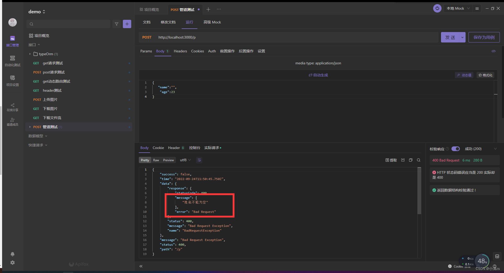

### 管道 可以做两件事

1. 转换，可以将前端传入的数据转成成我们需要的数据
2. 验证 类似于前端的 rules 配置验证规则

### 1.八个内置转换 API

ValidationPipe
ParseIntPipe
ParseFloatPipe
ParseBoolPipe
ParseArrayPipe
ParseUUIDPipe

<!-- 验证UUID -->

```sh
# 安装uuid
npm install uuid -S
npm install @types/uuid -D

```

```ts
// 生成一个uuid
import { v4 as uuidv4 } from "uuid";
console.log(uuidv4);
```

ParseEnumPipe
DefaultValuePipe

#### 2.pipe 管道验证 DTO

1. 先创建一个 pipe 验证管道

```sh
  # 根目录
  nest g resource login
  nest g pipe login
```

2.  安装验证器

```sh
npm i --save class-validator class-transformer
```

```ts
import { IsNotEmpty, IsString } from "class-validator";
export class CreatePDto {
  @IsNotEmpty() //验证是否为空
  @IsString() //是否为字符串
  name: string;

  @IsNotEmpty()
  age: number;
}
```

3. controller 使用管道 和定义类型
   

4. 实现验证 transform
   value 就是 前端传过来的数据 metaData 就是元数据 通过 metatype 可以去实例化这个类
   
   实例化 DTO

   通过 validate 验证 DTO 返回一个 promise 的错误信息 如果有错误抛出

5. 注册全局 DTO 验证管道
   
   
