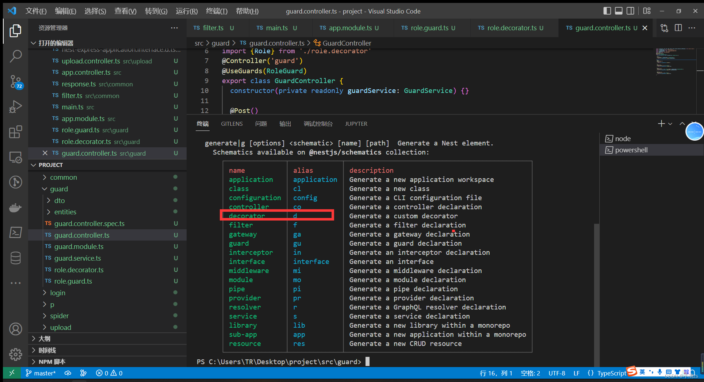

在Nestjs 中我们使用了大量装饰器 decorator ，所以Nestjs 也允许我们去自定义装饰器。



###  案例1 自定义权限装饰器

生成装饰器 
```sh
nest g decorator auth
```


###  案例2 自定义参数装饰器返回一个url

``` ts
// role.decorator.ts
import { SetMetadata,createParamDecorator,ExecutionContext ,applyDecorators } from '@nestjs/common';
import type {Request} from 'express'
 
export const Role = (role: string[]) => {
    console.log(role,1)
    return SetMetadata('role', role);
}
 
export const ReqUrl = createParamDecorator((data:string,ctx:ExecutionContext)=>{
    const req = ctx.switchToHttp().getRequest<Request>()
    return req.url
})

