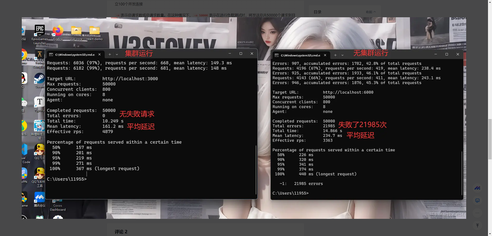

# 什么是集群?

Node.js 集群（Cluster）是一种技术，用于在多核系统上创建多个 Node.js 进程，以充分利用系统的所有 CPU 核心，

从而提高应用的性能和可用性。Node.js 本身是单线程的，集群模块提供了一种方式，通过使用多个进程来并行处理工作负载。

# 基本概念

单线程限制：Node.js 是基于单线程的事件驱动模型，默认情况下只能使用一个 CPU 核心。

多进程架构：通过集群模块，可以创建多个 Node.js 进程（称为工作进程），每个进程可以处理部分流量，从而利用多个 CPU 核心。

# 案例演示

Node.js 提供了内置的 cluster 模块来创建和管理集群。使用这个模块，可以轻松地创建多个工作进程并共享同一个服务器端口

```js
import cluster from "node:cluster";
import http from "node:http";
import os from "node:os";
const cpus = os.cpus().length;

// 主进程
if (cluster.isPrimary) {
  for (let i = 0; i < cpus; i++) {
    cluster.fork(); // 创建子进程
  }
}
// 子进程
else {
  http
    .createServer((req, res) => {
      res.writeHead(200);
      res.end("cluster is running");
    })
    .listen(3000, () => {
      console.log("http://127.0.0.1:3000");
    });
}
```

使用 ps node 查询进程


集群运行跟非集群运行对比
编写一个非集群的服务,index2.js 非集群运行

```js
import http from "node:http";

http
  .createServer((req, res) => {
    res.writeHead(200);
    res.end("cluster is running");
  })
  .listen(6000, () => {
    console.log("http://127.0.0.1:6000");
  });
```

安装测试工具

```sh
npm install -g loadtest

```

执行命令

```sh
loadtest http://localhost:3000 -n 50000 -c 100
loadtest http://localhost:6000 -n 50000 -c 100

```

-c 表示并发用户数或并发连接数。在这种情况下，-c 100 表示在进行负载测试时，同时模拟 100 个并发用户或建立 100 个并发连接

-n 表示总请求数或总请求数量。在这种情况下，-n 50000 表示在进行负载测试时，将发送总共 50000 个请求到目标网站

我们可以看到集群的平均延迟是161ms 非集群是 234.7ms ，基于这些测试，可以看到集群并没有给应用程序的性能带来太大的改善，但是接口的安全性还是保证了几乎没有失败的请求

