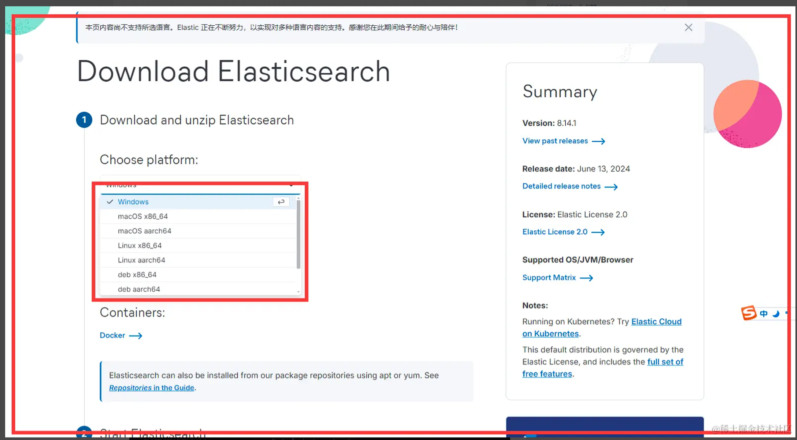
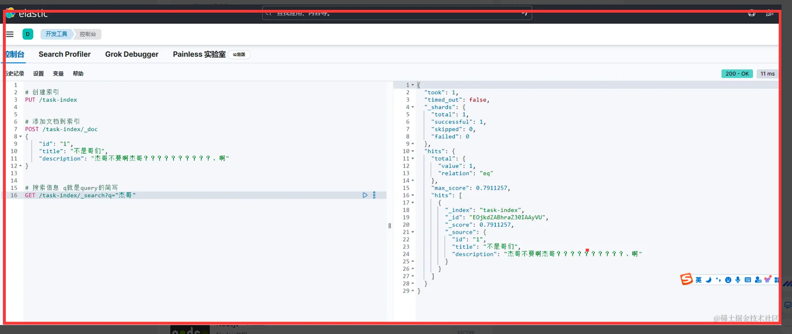

# 什么是 ElasticSearch?

ElasticSearch 是一个开源的、分布式的搜索和分析引擎，特别擅长处理大规模的日志和文本数据。它基于 Apache Lucene 构建，提供了强大的全文本搜索功能和实时的数据分析能力。ElasticSearch 常用于日志和事件数据的实时搜索、分析以及大型文本数据的全文检索。

# 场景

1. 应用程序日志分析：实时分析应用程序日志，以便快速发现和解决问题。
2. 网站搜索：为网站提供快速的全文搜索功能，提升用户体验
3. 地图服务：提供基于位置的搜索和导航服务

# 安装

## 1. 安装 elastic

下载地址 https://www.elastic.co/cn/downloads/elasticsearch


1. 选择你所拥有的操作系统下载即可
2. 解压到你喜欢的目录即可

tip: 如果你要使用你自己的 java 版本配置 JAVA_HOME 环境变量即可，如果你用 Elastic 自带的 JDK 也是可以的 目前自带的版本是 21.0.2

3. 启动运行 bin 目录下面的 elasticsearch.bat 文件
4. 修改 elastic 密码 执行 bin 目录 下面的 elasticsearch-reset-password -u elastic -i 然后输出密码即可 例如 123456

5. 关闭 https 打开 elasticSearch/config/elasticsearch.yml 修改为 false
   

```yml
# 出现 kibana missing authentication credentials for REST request
xpack.security.enabled: false
```

访问 http://localhost:9200 即可 默认端口 9200


6. 账号是 elastic 密码是第四条你修改之后的密码 返回以下信息即可成功
   

## 2. 安装 kibana

Kibana 是一个开源的分析和可视化平台，设计用于和 Elasticsearch 一起工作,你用 Kibana 来搜索，查看，并和存储在 Elasticsearch 索引中的数据进行交互

下载地址 https://www.elastic.co/cn/downloads/kibana

选择对应的操作系统即可


tip: Kibana 基于 Nodejs 环境开发，需要安装 Nodejs 安装过的忽略

1. 下载完成解压到你喜欢的目录即可 (解压比较慢等待即可)
2. 解压完成运行 kibana/bin/kibana.bat 文件即可

```yml
# Kibana/config/kibana.yml
# 默认问英文,设置为中文
i18n.locale: "zh-CN"
```

3. 打开之后访问 http://localhost:5601/
   

添加测试数据


访问测试数据


# 对接 Node.js

安装依赖包

```sh
npm install @elastic/elasticsearch

```

增删改差的实现
核心概念

1. 索引类似于关系型数据库中的数据库概念。它是一个包含文档的集合。每个索引都有一个名字，这个名字在进行搜索、更新、删除等操作时作为标识使用，其实也就是类似于数据库的 database
2. 文档(document) 文档是 Elasticsearch 中的基本信息单元，类似于关系型数据库中的行（row）。文档是以 JSON 格式存储的，每个文档包含一个或多个字段（field），字段是键值对的形式

```js
import { Client } from "@elastic/elasticsearch";
const client = new Client({
  node: "http://localhost:9200",
  auth: {
    username: "elastic",
    password: "123456",
  },
});
//创建索引 + 数据
const user = await client.index({
  index: "user-data",
  document: {
    user: 1,
    age: 18,
    name: "jack",
  },
});
//查询数据
const response = await client.get({
  index: "user-data",
  id: user._id, //id可以指定也可以让elasticsearch自动生成
});
//搜索
const result = await client.search({
  index: "user-data", //指定索引
  query: {
    //查询条件
    match: {
      name: "jack", //模糊查询
    },
  },
  size: 1, //指定返回条数
});
console.log(result.hits.hits); //打印搜索结果
//删除
await client.delete({
  index: "user-data",
  id: user._id,
});
```

# 可视化使用

```sh

# 创建索引
PUT /task-index


# 添加文档到索引
POST /task-index/_doc
{
    "id": "1",
    "title": "不是哥们",
    "description": "杰哥不要啊杰哥？？？？？？？？？？、啊"
}


# 搜索信息 q就是query的简写
GET /task-index/_search?q="杰哥"

```


