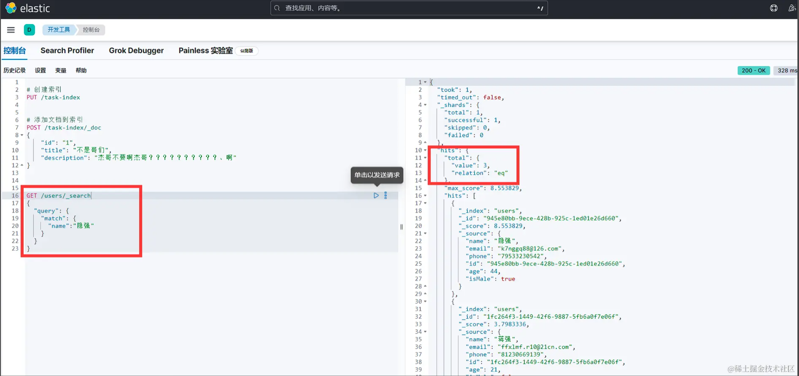
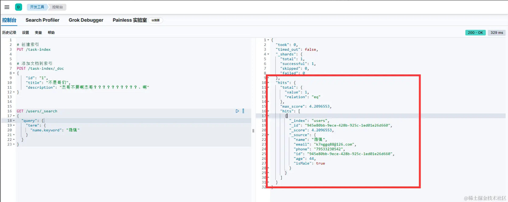
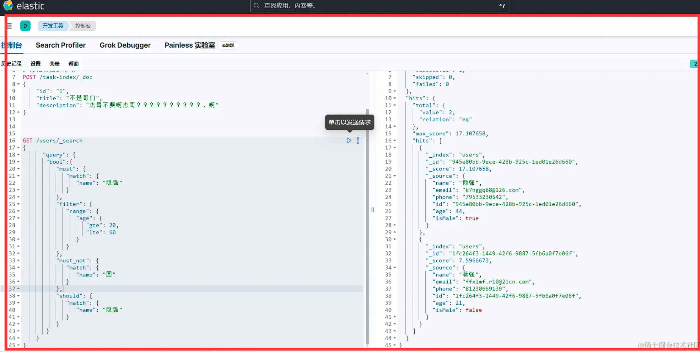

### 模拟假数据

安装依赖包

```sh
npm install @elastic/elasticsearch @faker-js/faker

```

1. 安装库 @faker-js/faker 模拟假数据的一个库非常好用支持中文
2. 使用中文 locale: [zh_CN], 设置即可
3. 生成名字，邮箱，手机号，id，年龄，性别
4. 生成完成之后使用 fs 写入 data.json 文件

```js
import { Faker, zh_CN } from "@faker-js/faker";
const faker = new Faker({
  locale: [zh_CN],
});
const generate = (total = 100) => {
  let arr = [];
  for (let i = 0; i < total; i++) {
    arr.push({
      name: faker.person.fullName(),
      email: faker.internet.email(),
      phone: faker.string.numeric({ length: 11 }),
      id: faker.string.uuid(),
      age: faker.number.int({ min: 18, max: 60 }),
      isMale: faker.datatype.boolean(),
    });
  }
  return arr;
};

fs.writeFileSync("./data.json", JSON.stringify(generate(), null, 2));
```

假数据

```json
 [{
    "name": "隐强",
    "email": "k7nggq88@126.com",
    "phone": "79533230542",
    "id": "945e80bb-9ece-428b-925c-1ed01e26d660",
    "age": 44,
    "isMale": true
  },
   ......]

```

### Node.js 集成 ElasticSearch

1. fs 读取刚才写入的文件
2. 安装 ElasticSearch 的包@elastic/elasticsearc
3. 连接 elastic 两种模式可以使用 apiKey，也可以用账号密码的模式，这儿使用账号密码，生产使用 apiKey
4. 检查有没有创建过这个索引如果重复创建会报错
5. 如果没有创建过这个索引就创建，并且构建映射表 也就是字段 properties
6. 批量插入数据封装一个函数 bulkInsert
7. 实现插入的函数 bulkInsert
8. 搜索

```js
//1.第一步
const data = fs.readFileSync("./data.json", "utf-8");
const arr = JSON.parse(data);
//2.第二步
import { Client } from "@elastic/elasticsearch";
//3.第三步
const client = new Client({
  node: "http://localhost:9200",
  auth: {
    username: "elastic",
    password: "123456",
  },
});
//4.第四步
const exists = await client.indices.exists({ index: "users" });
//5.第五步
if (!exists) {
  await client.indices.create({
    index: "users",
    mappings: {
      properties: {
        name: { type: "text", fields: { keyword: { type: "keyword" } } },
        email: { type: "text" },
        phone: { type: "text" },
        id: { type: "text" },
        age: { type: "integer" },
        isMale: { type: "boolean" },
      },
    },
  });
  //6.第六步
  await bulkInsert(arr);
}
//7.第七步
const bulkInsert = async (data) => {
  const operations = [];
  data.forEach((item) => {
    operations.push({
      index: {
        _index: "users",
        _id: item.id,
      },
    });
    operations.push(item);
  });
  //批量插入
  await client.bulk({ refresh: true, operations });
};
//8.搜索
const response = await client.search({
  index: "users",
  query: {
    match_all: {},
  },
  size: 100,
});
console.log(response.hits.hits);
```

### 搜索详解

根据上面代码 + 讲解基本已经大概了解其工作原理，ElasticSearch 最强大的就是他的搜索能力，可以各种组合搜索，我们分别演示一下

1. 全部查询
   match_all 就是全部查询 注意默认只返回 10 条，你可以配置 size 看你想要返回的条数

```js
const response = await client.search({
  index: "users",
  query: {
    match_all: {}, //空对象即可
  },
  size: 100, //返回100条
});
```


2. 模糊查询

模糊查询会进行分词，匹配所有的关键词

使用 match 进行模糊查询，输入需要匹配的字段如 name 后面是 value 如 隐强 他会匹配数据中所有包含 隐强 这两个字的内容 我的数据中含有 隐强 蒋强 高启强 因此返回三条

```js
const response = await client.search({
  index: "users",
  query: {
    match: {
      name: "隐强",
    },
  },
  size: 100,
});
console.log(response.hits.hits);
```



3. 精确查询

如果需要支持精准查询 需要设置 name: { type: 'text', fields: { keyword: { type: 'keyword', } } },

因为 text 类型默认会支持分词，为了全文搜索设计，但是如果要同时支持 全文匹配 + 精准匹配 需要设置 type keyword

注意这儿就不使用 match 了，改成 term [字段.keyword] = [value] 查询

```js
const response = await client.search({
  index: "users",
  query: {
    term: {
      "name.keyword": "隐强",
    },
  },
  size: 100,
});
console.log(response.hits.hits);
```



4. 组合查询

1. must 必须匹配的条件 这儿匹配了(隐强)
1. filter 条件过滤 这儿匹配了年龄(20-60 岁的人)
1. must_not 必须不匹配 (这儿表示返回的值不能有带国字的人)
1. should 可选的条件 (这儿匹配了隐强)

```js
const response = await client.search({
  index: "users",
  query: {
    bool: {
      must: {
        match: {
          name: "隐强",
        },
      },
      filter: {
        range: {
          age: {
            gte: 20,
            lte: 60,
          },
        },
      },
      must_not: {
        match: {
          name: "国",
        },
      },
      should: {
        match: {
          name: "隐强",
        },
      },
    },
  },
  size: 100,
});
console.log(response.hits.hits);
```



5. 聚合查询

聚合查询在 Elasticsearch 中用来对数据进行统计、汇总和分析，它能够提供关于数据集的深入见解和洞察

案例 统计各个年龄出现的次数 注意使用 aggs 不再是 query 了

```js
const response = await client.search({
  index: "users",
  aggs: {
    age: {
      terms: {
        field: "age",
      },
    },
  },
  size: 100,
});
console.log(response.aggregations.age.buckets);
```

返回值

key：表示聚合的字段值，这里看起来是年龄。

doc_count：表示具有该年龄的文档数量。

```json
[
  { "key": 32, "doc_count": 6 }, //表示年龄32 出现6次
  { "key": 23, "doc_count": 4 }, //表示年龄23 出现4次
  { "key": 28, "doc_count": 4 }, //.......
  { "key": 29, "doc_count": 4 },
  { "key": 49, "doc_count": 4 },
  { "key": 51, "doc_count": 4 },
  { "key": 60, "doc_count": 4 },
  { "key": 21, "doc_count": 3 },
  { "key": 22, "doc_count": 3 },
  { "key": 24, "doc_count": 3 }
]
```
