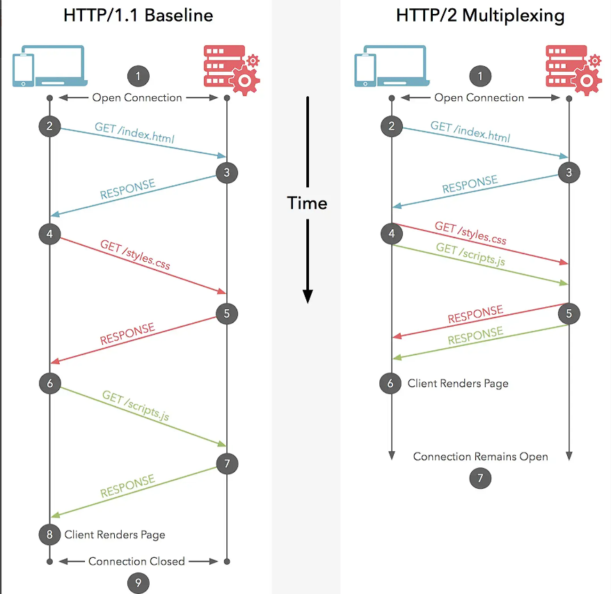
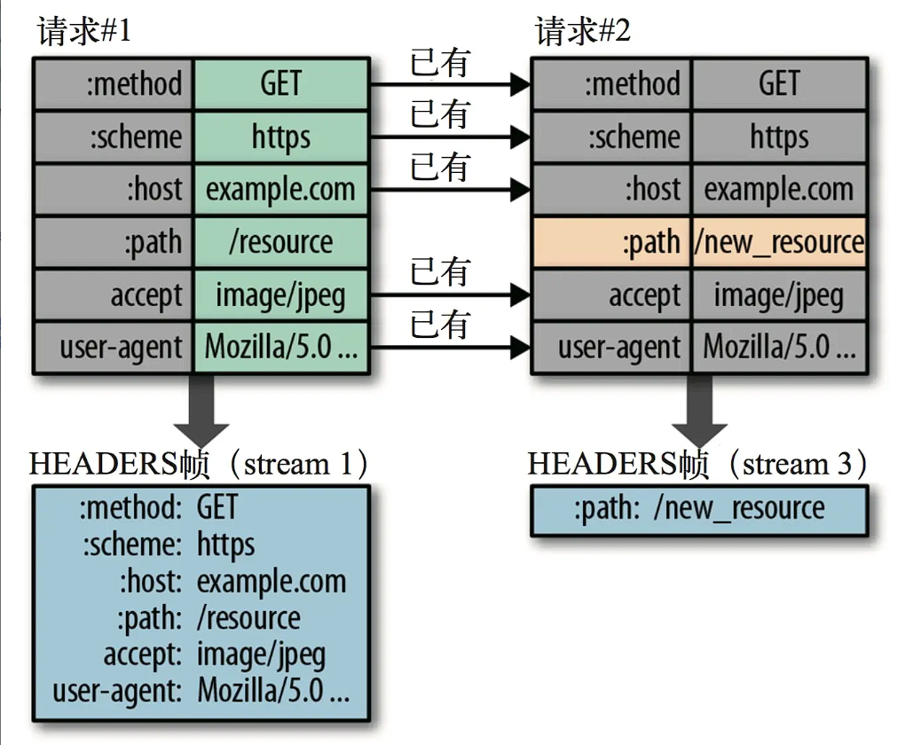

### HTTP/2

（HTTP2）是超文本传输协议（HTTP）的下一个主要版本，它是对 HTTP/1.1 协议的重大改进。HTTP/2 的目标是改善性能、效率和安全性，以提供更快、更高效的网络通信

1. 多路复用（Multiplexing）
   HTTP/2 支持在单个 TCP 连接上同时发送多个请求和响应。这意味着可以避免建立多个连接，减少网络延迟，提高效率。
   

2. 二进制分帧（Binary Framing）：
   在应用层（HTTP2）和传输层（TCP or UDP）之间增加了二进制分帧层，将请求和响应拆分为多个帧（frames）。这种二进制格式的设计使得协议更加高效，并且容易解析和处理。
   

### 帧：最小的通信单位，承载特定类型的数据，比如 HTTP 首部、负荷

### HTTP/2 帧类型：

1. 数据帧（Data Frame）：用于传输请求和响应的实际数据。
2. 头部帧（Headers Frame）：包含请求或响应的头部信息。
3. 优先级帧（Priority Frame）：用于指定请求的优先级。
4. 设置帧（Settings Frame）：用于传输通信参数的设置。
5. 推送帧（Push Promise Frame）：用于服务器主动推送资源。
6. ING 帧（PING Frame）：用于检测连接的活跃性。
7. 重置帧（RST_STREAM Frame）：用于重置数据流或通知错误。

8. 头部压缩（Header Compression）：
   HTTP/2 使用首部表（Header Table）和动态压缩算法来减少头部的大小。这减少了每个请求和响应的开销，提高了传输效率。

# 请求一发送了所有的头部字段，第二个请求则只需要发送差异数据，这样可以减少冗余数据，降低开销

### 截止 2024-4-2 日 目前没有浏览器支持 http 请求访问 http2,所以要用 https

### openssl 生成 tls 证书

1. 生成私钥

sh 复制代码 openssl genrsa -out server.key 1024

2. 生成证书请求文件(用完可以删掉也可以保留)

sh 复制代码 openssl req -new -key server.key -out server.csr

3. 生成证书

sh 复制代码 openssl x509 -req -in server.csr -out server.crt -signkey server.key -days 3650
