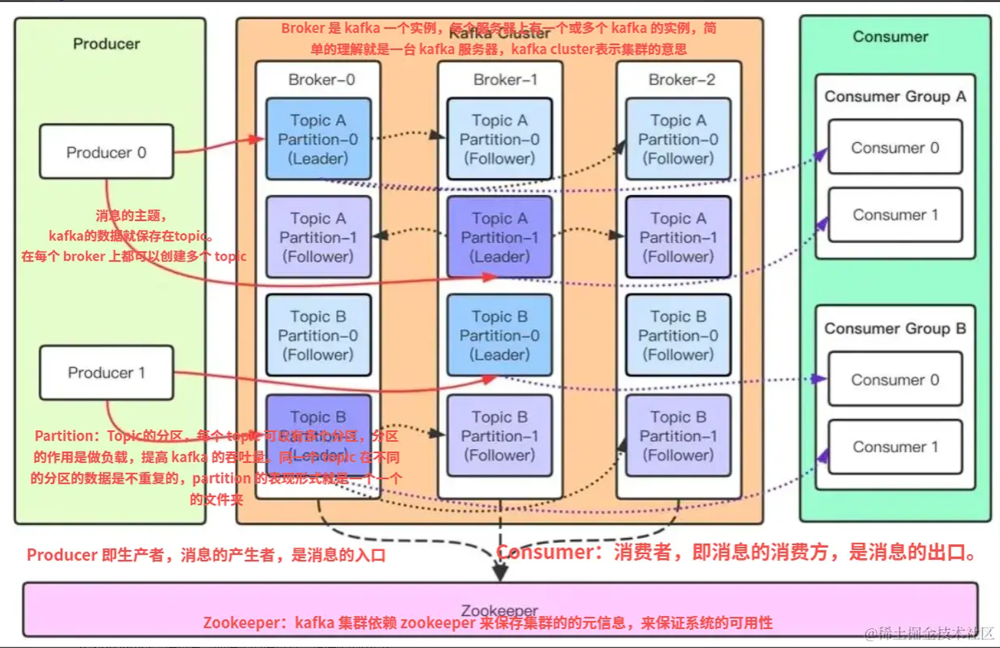
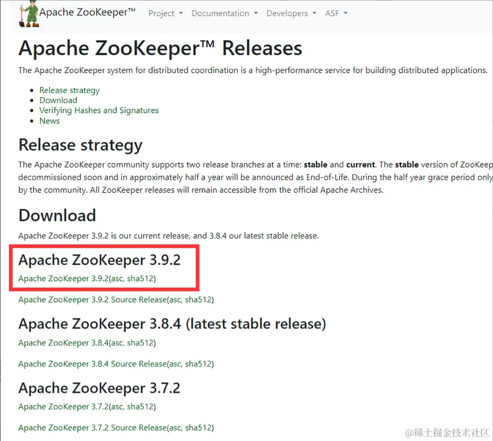
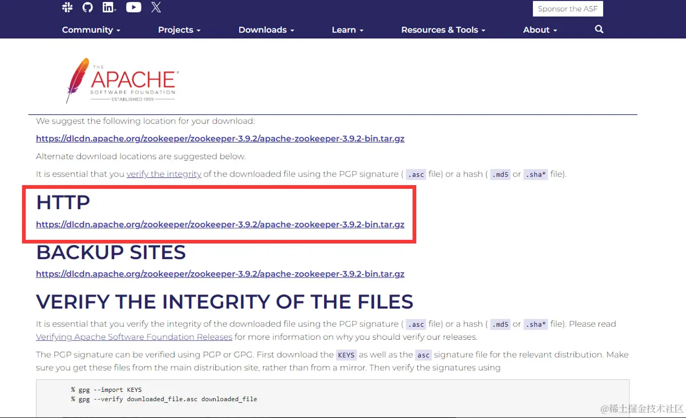
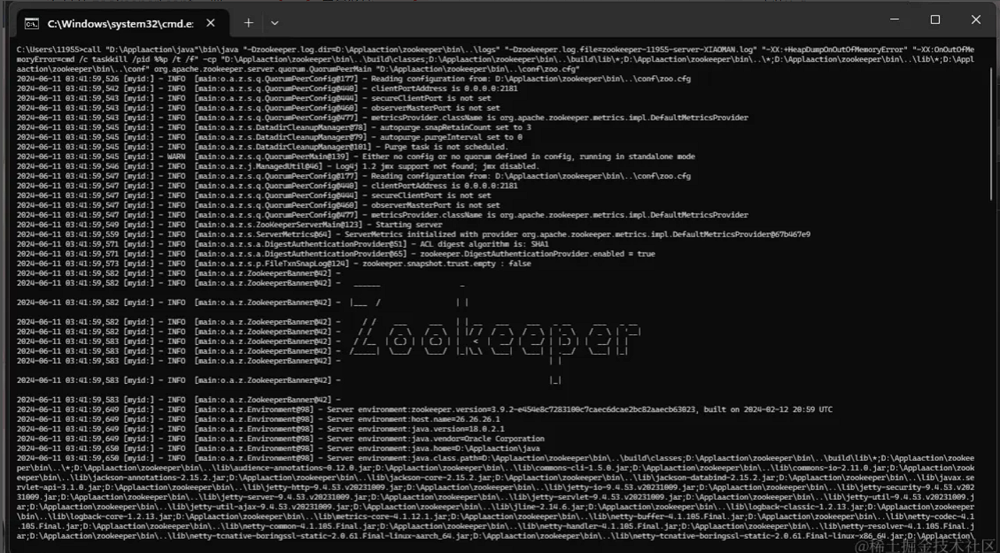
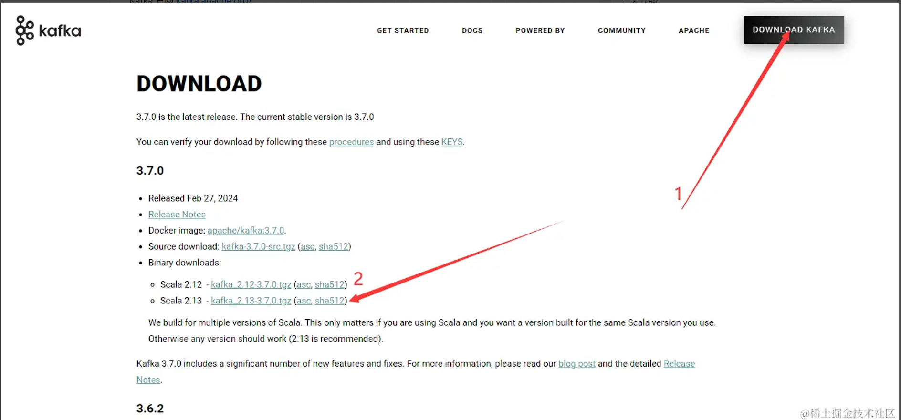
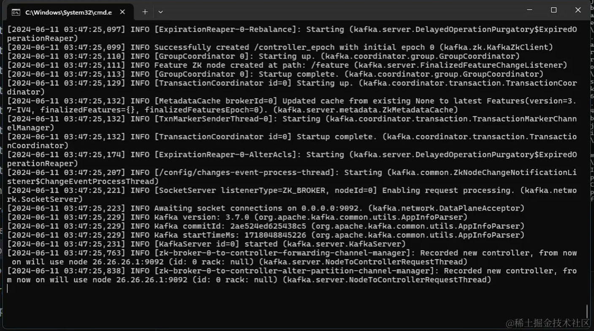

### 什么是 Kafka?

Kafka 的主要设计目标是提供一个可持久化的、高吞吐量的、容错的消息传递系统。它允许你以发布-订阅的方式发送和接收流数据，并且可以处理大量的消息，同时保持低延迟。Kafka 的设计还强调了分布式的特性，使得它可以在大规模集群中运行，处理大量数据和高并发的请求

### kafka 架构



1. Producer：生产者，消息的产生者，是消息的入口
2. Broker：Broker 是 kafka 一个实例，每个服务器上有一个或多个 kafka 的实例，简单的理解就是一台 kafka 服务器，​​kafka cluster​​ 表示集群的意思
3. Topic：消息的主题，可以理解为消息队列，kafka 的数据就保存在 topic。在每个 broker 上都可以创建多个 topic 。
4. Partition：Topic 的分区，每个 topic 可以有多个分区，分区的作用是做负载，提高 kafka 的吞吐量。同一个 5. topic 在不同的分区的数据是不重复的，partition 的表现形式就是一个一个的文件夹
5. Message：每一条发送的消息主体。
6. Consumer：消费者，即消息的消费方，是消息的出口。
7. Consumer Group：我们可以将多个消费组组成一个消费者组，在 kafka 的设计中同一个分区的数据只能被消费者组中的某一个消费者消费。同一个消费者组的消费者可以消费同一个 topic 的不同分区的数据，这也是为了提高 kafka 的吞吐量！
8. Zookeeper：kafka 集群依赖 zookeeper 来保存集群的的元信息，来保证系统的可用性

### 安装 Kafka

1. java

安装 JDK 因为 Kafka 用了 java 编写

```sh
# 测试是否安装成功
java --version
```

注意点 需要在环境变量配置 JAVA_HOME 因为 zookeeper 要读取这个环境变量 这个是必须的

2. ZooKeeper

因为 Kafka 也用到了 ZooKeeper

https://zookeeper.apache.org/releases.html




1. 把 apache-zookeeper-3.9.2-bin.tar.gz 解压到你喜欢的目录 重命名 zookeeper
2. 打开 zookeeper\conf ，把 zoo_sample.cfg 重命名成 zoo.cfg
3. 打开 zoo.cfg 修改 dataDir 改成 ./zookeeper/data
4. 把 D:\Applaaction\zookeeper\bin(例子) 配置到环境变量里面
5. 启动 打开 cmd 执行 zkServer (启动完成之后不要关闭)
   

6. Kafka

https://kafka.apache.org/



1. 把下载好的文件解压到你喜欢的目录里面
2. 把 kafka 文件夹名字 重新命名更短的名字 否则后面执行命令会报错(因为 cmd 不能支持很长的命令)
3. 打开 kafka/config/server.properties 文件 修改 log.dirs 改为 log.dirs=./logs
4. 启动 kafka 在 kafka 根目录执行 以下命令

```sh
.\bin\windows\kafka-server-start.bat .\config\server.properties
```



### Nodejs 编写基本用例测试 kafka

```sh
npm i kafkajs
```
