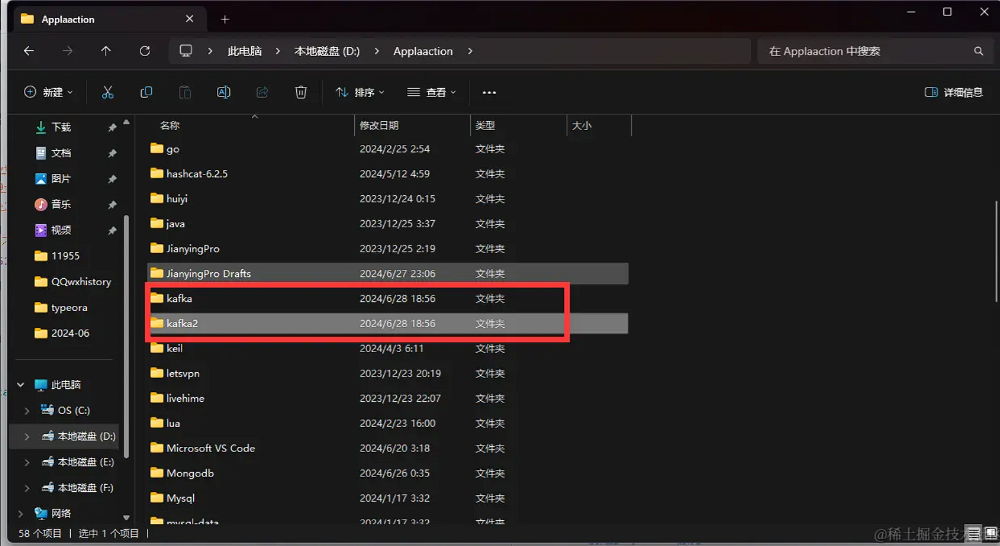
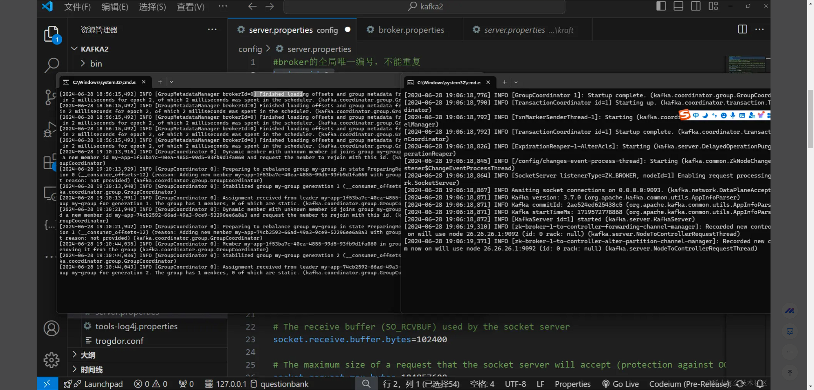

## Kafka 集群操作

### 1. 创建多个 kafka 服务

拷贝一份 kafka 完整目录改名为 kafka2


修改配置文件 kafka2/config/server.properties 这个文件

```js
broker.id=1 //唯一broker
port=9093 //切换端口
listeners=PLAINTEXT://:9093 //切换监听源

```

启动 zooKeeper 和 kafka 和 kafka2

```sh
.\bin\windows\kafka-server-start.bat .\config\server.properties

```



### 2.客户端管理

查看集群信息和客户端对象

```js
import { Kafka, CompressionTypes } from "kafkajs";

const kafka = new Kafka({
  clientId: "my-app", //客户端标识
  brokers: ["localhost:9092", "localhost:9093"], //kafka集群
});

const admin = kafka.admin(); //创建admin对象
await admin.connect(); //连接kafka
const cluster = await admin.describeCluster(); //获取集群信息
```

返回值 可以查看连接集群的信息比如端口 id 等

```js
{
  brokers: [
    { nodeId: 0, host: '26.26.26.1', port: 9092 },
    { nodeId: 1, host: '26.26.26.1', port: 9093 }
  ],
  controller: 0,
  clusterId: 'XHa77me4TZWO8cfWSTHoaQ'
}

```

### 注意： 创建的主题哪怕你断开连接也不会消失

创建主题 createTopics 将解析 true 主题是否已成功创建或 false 是否已存在。如果发生错误，该方法将抛出异常
删除主题 admin.deleteTopics 传入删除的主题
查看主题列表 listTopics 列出所有现有主题的名称，并返回一个字符串数组。如果发生错误，该方法将抛出异常`

```js
//创建主题
await admin.createTopics({
  topics: [
    { topic: "xiaoman", numPartitions: 1, replicationFactor: 1 },
    { topic: "xiaoman2", numPartitions: 1, replicationFactor: 1 },
  ],
});
//删除主题
await admin.deleteTopics({ topics: ["xiaoman", "xiaoman2"] });
//查看主题
await admin.listTopics().then((topics) => {
  console.log("topics", topics);
});
```

### 3.事务

KafkaJS 提供了对 Kafka 事务的支持，可以使用它来执行具有事务特性的操作。Kafka 事务用于确保一组相关的消息要么全部成功提交，要么全部回滚，从而保持数据的一致性

```js
import { Kafka, CompressionTypes } from "kafkajs";

const kafka = new Kafka({
  clientId: "my-app", //客户端标识
  brokers: ["localhost:9092", "localhost:9093"], //kafka集群
});

//生产者
const producer = kafka.producer({
  transactionalId: "填写事务ID",
  maxInFlightRequests: 1, //最大同时发送请求数
  idempotent: true, //是否开启幂等提交
});
//连接服务器
await producer.connect();

const transaction = await producer.transaction();
try {
  await transaction.send({
    topic: "xiaoman",
    messages: [{ value: "100元" }],
  });
  await transaction.commit(); // 事务提交
} catch (e) {
  console.log(e);
  await transaction.abort(); // 事务提交失败，回滚
}
await admin.disconnect();
```
