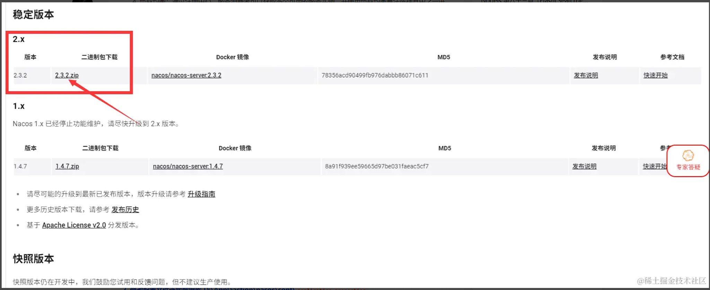
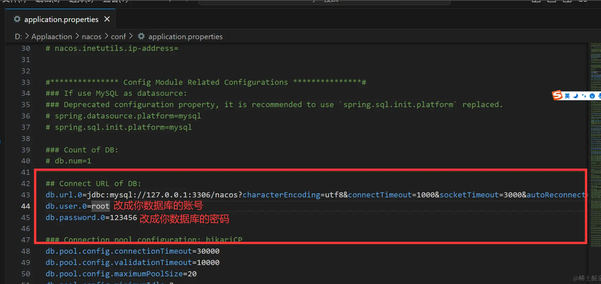
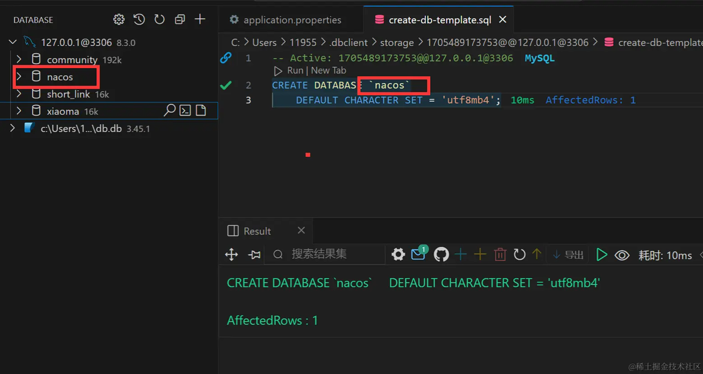
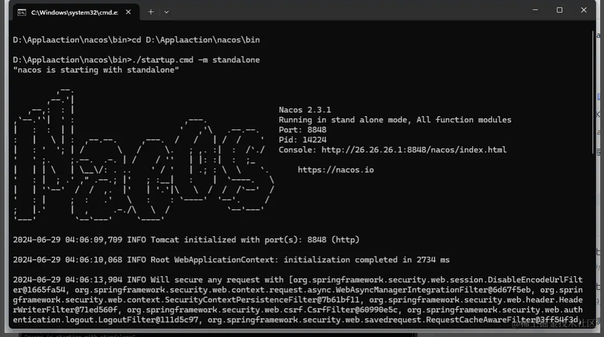
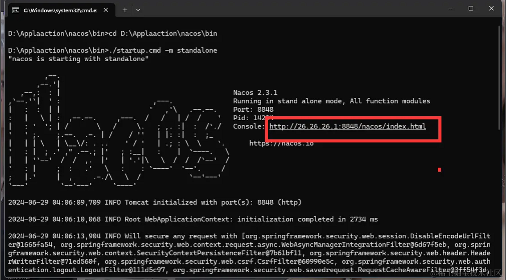
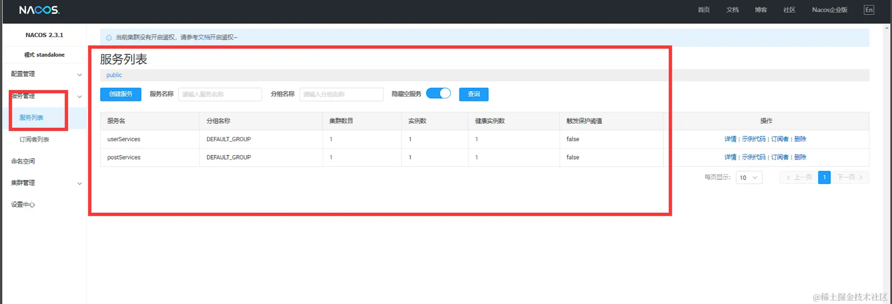

### 什么是 Nacos？

Nacos 是阿里开源的一个项目，他可以致力于帮助您发现、配置和管理微服务。Nacos 提供了一组简单易用的特性集，帮助您快速实现动态服务发现、服务配置、服务元数据及流量管理解决方案。

1. 服务注册：应用程序可以将自己的服务实例注册到 Nacos 注册中心，包括服务的唯一标识、网络地址和元数据等。通过注册，服务提供者可以告知 Nacos 它们的存在和可用性。
2. 服务发现：应用程序可以查询 Nacos 注册中心以发现可用的服务。服务消费者可以通过查询注册中心来获取服务提供者的信息，如 IP 地址和端口等，以便与之建立通信。
3. 服务健康检查：Nacos 注册中心可以周期性地检查已注册的服务实例的健康状态。它可以通过向服务实例发送心跳检查请求，并根据响应状态确定服务是否可用。
4. 负载均衡：通过注册中心，服务消费者可以获取多个可用的服务实例，并使用负载均衡算法选择其中之一进行请求处理。这样可以提高系统的可用性和性能。
5. 动态配置管理：Nacos 注册中心还提供了动态配置管理的功能。应用程序可以将配置信息注册到 Nacos 中，并且可以在运行时进行动态修改和刷新。这样可以避免应用程序重新启动或重新部署来更新配置。

### 安装

https://nacos.io/download/nacos-server/#%E7%A8%B3%E5%AE%9A%E7%89%88%E6%9C%AC



1. 下载完成解压到你喜欢的目录即可 记得名称改短一点例如 nacos

2. 修改配置文件连接数据库 D:\Applaaction\nacos\conf\application.properties

```js
//把注释打开默认是注释掉的 大概在42行左右
//127.0.0.1:3306/nacos ---> nacos是数据库名
db.url.0=jdbc:mysql://127.0.0.1:3306/nacos?characterEncoding=utf8&connectTimeout=1000&socketTimeout=3000&autoReconnect=true&useUnicode=true&useSSL=false&serverTimezone=UTC
db.user.0=root
db.password.0=123456

```



3. 创建 nacos 数据库并导入数据库文件并且注册数据库

```sql
CREATE DATABASE `nacos`
    DEFAULT CHARACTER SET = 'utf8mb4';

```



右键导入 sql 文件 选择 cong 目录下面的 mysql-schema.sql 这个文件 然后导入


4. 编写启动命令
   放在桌面上即可

```sh
# 创建nacos.bat文件
cd D:\Applaaction\nacos\bin
.\startup.cmd -m standalone
```

5. 安装 java 环境
   新版安装成功后无需配置环境变量自己就配好了，旧版本则需手动配置一下环境变量

6. 启动 nacos

双击刚才编写好的启动脚本即可 第四小节编写的那个 bat 文件


7. 访问 nacos 客户端
   

### 代码案例 Nodejs

```sh
npm install nacos
```

服务器注册 + 健康检测

post.js 简单起个服务端口 8080

```js
import http from "node:http";

http
  .createServer((req, res) => {
    res.setHeader("Content-Type", "application/json");
    res.end(JSON.stringify({ msg: "8080Server" }));
  })
  .listen(8080, () => {
    console.log("8080Server");
  });
```

user.js 简单起个服务 端口 8081

```js
import http from "node:http";
http
  .createServer((req, res) => {
    res.setHeader("Content-Type", "application/json");
    res.end(JSON.stringify({ msg: "8081Server" }));
  })
  .listen(8081, () => {
    console.log("8081Server");
  });
```

register.js

```js
import Nacos from "nacos";
const client = new Nacos.NacosNamingClient({
  serverList: ["127.0.0.1:8848"], // 服务地址
  namespace: "public", // 命名空间
  logger: console, // 用于打印日志
});
await client.ready(); // 等待注册中心连接成功

const postServerName = "postServices";
client.registerInstance(postServerName, {
  ip: "127.0.0.1", // 服务实例IP
  port: 8080, // 服务实例端口
  weight: 1, // 服务实例权重
  enable: true, // 是否健康检查
  healthy: true, // 是否健康
  metadata: {
    "nacos.healthcheck.type": "HTTP", // 健康检查方式
    "nacos.healthcheck.url": "/health", // 健康检查地址
    "nacos.healthcheck.interval": 5, // 健康检查间隔时间
    "nacos.healthcheck.timeout": 3, // 健康检查超时时间
  },
});

const userServerName = "userServices";
client.registerInstance(userServerName, {
  ip: "127.0.0.1", // 服务实例IP
  port: 8081, // 服务实例端口
  weight: 1, // 服务实例权重
  enable: true, // 是否健康检查
  healthy: true, // 是否健康
  metadata: {
    "nacos.healthcheck.type": "HTTP", // 健康检查方式
    "nacos.healthcheck.url": "/health", // 健康检查地址
    "nacos.healthcheck.interval": 5, // 健康检查间隔时间
    "nacos.healthcheck.timeout": 3, // 健康检查超时时间
  },
});
```


