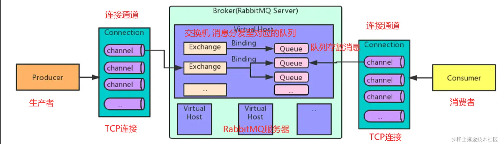

### AMQP

AMQP 是一个应用层协议，基于 TCP/IP 协议栈，用于在分布式系统中进行消息传递。

AMQP(高级消息队列协议) 实现了对于消息的排序，点对点通讯，和发布订阅，保持可靠性、保证安全性。

### 什么是 RabbitMQ?

1. RabbitMQ 是一个开源的，在 AMQP 基础上完整的，可复用的企业消息系统。
2. 支持主流的操作系统，Linux、Windows、MacOS 等
3. 多种开发语言支持，Java、Python、Ruby、.NET、PHP、C/C++、javaScript 等

### RabbitMQ 核心概念

1. 消息：在 RabbitMQ 中，消息是传递的基本单元。它由消息体和可选的属性组成
2. 生产者 Producer：生产者是消息的发送方，它将消息发送到 RabbitMQ 的交换器（Exchange）中
3. 交换器 Exchange：交换器接收从生产者发送的消息，并根据特定的规则将消息路由到一个或多个队列中
4. 队列 Queue：队列是消息的接收方，它存储了待处理的消息。消费者可以从队列中获取消息并进行处理
5. 消费者 Consumer：消费者是消息的接收方，它从队列中获取消息并进行处理



### RabbitMQ 的安装

1. 安装 Rabbit MQ 的依赖环境 erlang
<blockquote>因为MQ是基于这个语言开发的</blockquote>

环境变量：ERLANG_HOME: D:\Erlang\Erlang OTP\bin

path: %ERLANG_HOME%\sbin
```sh
erl 
```

2. 安装 MQ

环境变量：RabbitMQ_Server: D:\Rabbitmq\RabbitMQ Server\rabbitmq_server-3.13.3

path: %RabbitMQ_Server%


### 注意
配置完环境变量之后，由于依赖erlang环境变量，cli指令会默认读系统变量的 ERLANG_HOME，且ERLANG_HOME的路径只能是根目录


3. 启动 MQ

```sh
 #安装MQ插件拥有可视化面板
  rabbitmq-plugins enable rabbitmq_management
```

4. 启动MQ命令

```sh
 #MQ默认端口5672
  rabbitmq-server.bat start
```

5. 访问 http://localhost:15672/#/ 账号密码都是 guest

### 应用场景

1. 微服务之间的通讯，或者跨语言级别通讯
2. 异步任务，比如执行完成一个接口需要发送邮件，我们无需等待邮件发送完成再返回，我们可以直接返回结果，在异步任务中处理邮件。
3. 日志的收集和分发，将应用程序的日志消息发送到 RabbitMQ 队列中，然后使用消费者进行处理和分发。这样可以集中管理和处理日志，提供实时监控和分析


### 查找进程，pid
```sh
netstat -ano | findstr :25672
# TCP    0.0.0.0:25672          0.0.0.0:0              LISTENING       27628 
# 27628就是pid
```