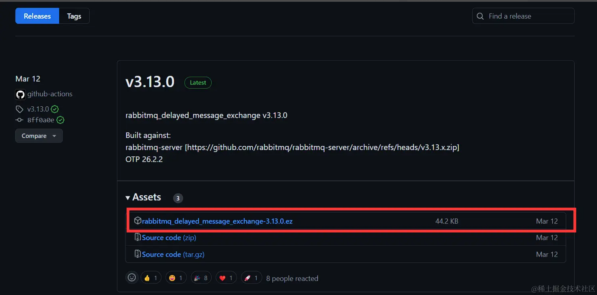
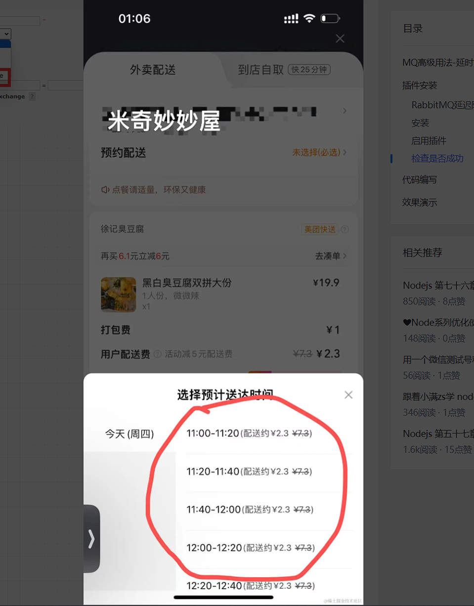

### 延时消息

什么是延时消息?

Producer 将消息发送到 MQ 服务端，但并不期望这条消息立马投递，而是延迟一定时间后才投递到 Consumer 进行消费，该消息即延时消息

### 插件安装

<a href="https://github.com/rabbitmq/rabbitmq-delayed-message-exchange/releases"></a>

1. 下载
   

2. 把下载好的文件拖到你的 rabbitMQ 下面的 plugins 目录里面

```sh
D:\Applaaction\rabbitmq_server-3.13.0\plugins
```

3. 启用插件

```sh
rabbitmq-plugins enable rabbitmq_delayed_message_exchange
```

4. 检查是否成功

打开可视化面板 访问 http://localhost:15672/#/ 账号密码都是 guest

发现新增了一个延迟队列类型 x-delayed-message


### 代码编写

1. 应用场景
