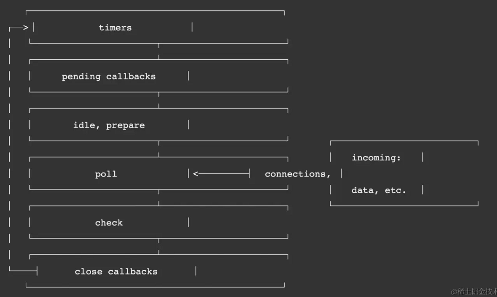

### 事件循环

在 Nodejs 中，事件循环分为 6 个阶段。每个阶段都有一个任务队列。当 Node 启动时，会创建一个事件循环线程，并依次按照下图所示顺序进入每个阶段，执行每个阶段的回调


### Nodejs 事件循环可以划分为两种，微任务和宏任务

## 宏任务

1. timers 执行 setTimeout 和 setInterval 的回调
2. pending callbacks 执行推迟的回调如 IO，计时器 (内部使用无需关心)
3. idle，prepare 空闲状态 nodejs 内部使用无需关心
4. poll 执行与 I/O 相关的回调（除了关闭回调、计时器调度的回调和 setImmediate 之外，几乎所有回调都执行） 例如 fs 的回调 http 回调
5. check 执行 setImmediate 的回调
6. close callback 执行例如 socket.on('close', ...) 关闭的回调

## 微任务

1. process.nextTick
2. promise

高版本：promise > process.nextTick (nodejs V20 测试)
低版本：process.nextTick > promise (nodejs V10 测试)

### 注意事项 不准确计时器(setImmediate 优先 setTimeout 执行)

在事件循环的每个循环迭代中，libuv 会调用 uv\_\_update_time 函数来更新当前的时间戳。这个时间戳通常用于计算定时器的超时时间和检查事件的发生时间，
而 setImmediate，则是把回调函数直接插入队列，所以执行效率比较高。所以就会造成顺序不稳定的一个原因

### 剖析源码 libuv/src/unix/core.c

```c
int uv_run(uv_loop_t* loop, uv_run_mode mode) {
  int timeout;
  int r;
  int can_sleep;

  r = uv__loop_alive(loop); //检查事件循环是否活跃
  if (!r) //如果事件循环不活跃，直接返回
    uv__update_time(loop); //调用这个函数更新时间戳去检查计时器 超时时间 耗时

  /* Maintain backwards compatibility by processing timers before entering the
   * while loop for UV_RUN_DEFAULT. Otherwise timers only need to be executed
   * once, which should be done after polling in order to maintain proper
   * execution order of the conceptual event loop. */
  if (mode == UV_RUN_DEFAULT && r != 0 && loop->stop_flag == 0) {
    uv__update_time(loop); //更新时间
    uv__run_timers(loop); //执行定时器
  }

  while (r != 0 && loop->stop_flag == 0) {
    can_sleep =
        uv__queue_empty(&loop->pending_queue) &&
        uv__queue_empty(&loop->idle_handles);

    uv__run_pending(loop); //执行事件队列中的事件
    uv__run_idle(loop); //执行空闲队列中的事件
    uv__run_prepare(loop); //执行预备队列中的事件

    timeout = 0;
    if ((mode == UV_RUN_ONCE && can_sleep) || mode == UV_RUN_DEFAULT)
      timeout = uv__backend_timeout(loop);

    uv__metrics_inc_loop_count(loop);

    uv__io_poll(loop, timeout); //执行事件循环

    /* Process immediate callbacks (e.g. write_cb) a small fixed number of
     * times to avoid loop starvation.*/
    for (r = 0; r < 8 && !uv__queue_empty(&loop->pending_queue); r++)
      uv__run_pending(loop);

    /* Run one final update on the provider_idle_time in case uv__io_poll
     * returned because the timeout expired, but no events were received. This
     * call will be ignored if the provider_entry_time was either never set (if
     * the timeout == 0) or was already updated b/c an event was received.
     */
    uv__metrics_update_idle_time(loop); //更新空闲时间

    uv__run_check(loop); //执行检查队列中的事件 setImmediate
    uv__run_closing_handles(loop); //执行关闭队列中的事件

    uv__update_time(loop); //更新时间
    uv__run_timers(loop); //执行定时器

    r = uv__loop_alive(loop);
    if (mode == UV_RUN_ONCE || mode == UV_RUN_NOWAIT)
      break;
  }


```
