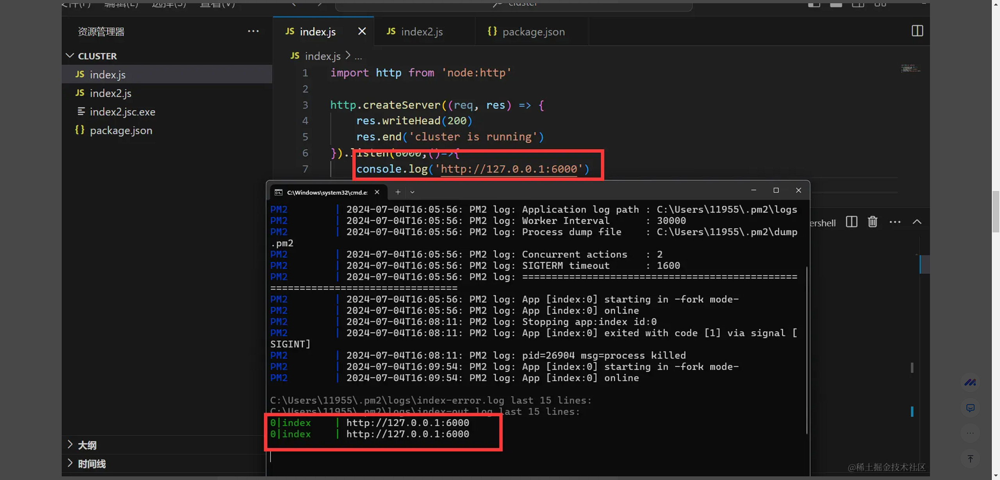
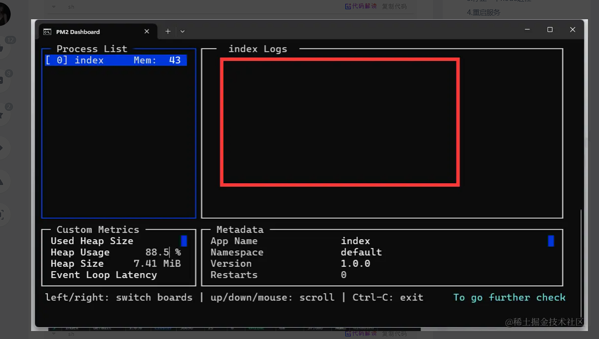
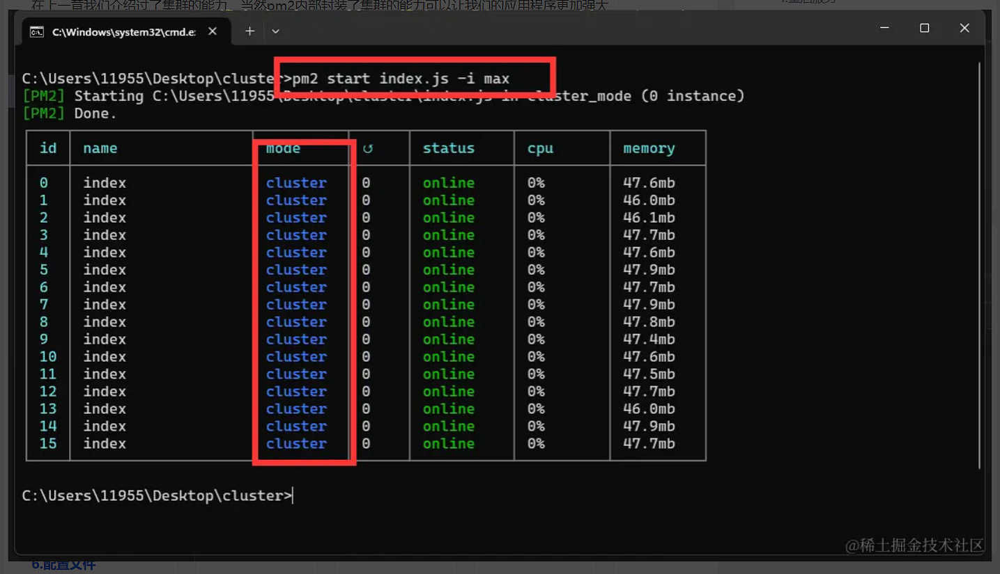

# Node.js 如何部署?

如果要部署 Nodejs 项目，第一点肯定是需要有台服务器，第二点需要一个部署工具这里使用 pm2

# PM2

1. PM2 是一个非常流行的 Node.js 进程管理工具，用于在生产环境中运行和监控 Node.js 应用程序。它提供了多种功能，帮助开发者更好地管理和优化他们的应用程序,pm2 能做的其实有很多,比如监听文件改动自动重启,统一管理多个进程,内置的负载均衡,日志系统等等,
2. 进程管理：PM2 可以轻松地启动、停止、重启和删除 Node.js 应用程序进程。它支持启动多个进程以利用多核 CPU，提高应用的性能和稳定性。
   负载均衡：通过集群模式，PM2 可以创建多个应用实例并自动进行负载均衡，确保应用在高并发情况下仍能稳定运行。
3. 自动重启：当应用程序崩溃或出现错误时，PM2 能自动重启应用，确保服务的高可用性。
4. 日志管理：PM2 提供了全面的日志管理功能，可以方便地查看、合并和分析应用程序的日志信息。
5. 监控和性能分析：PM2 内置监控功能，可以实时查看应用程序的性能指标（如 CPU 和内存使用情况）。此外，PM2 还集成了 Keymetrics，这是一个专门用于 Node.js 应用的性能监控和管理平台。
6. 配置文件支持：PM2 支持通过 JSON 文件或 JavaScript 文件进行配置，便于管理多个应用和环境配置。
7. 热重载：在不停止服务的情况下，PM2 可以重新加载应用代码，从而减少停机时间。
8. 容器支持：PM2 可以与 Docker 等容器技术很好地集成，方便在容器化环境中管理 Node.js 应用。

# 基本使用

## 1.安装

```sh
npm install pm2 -g

```

## 2.基本使用

随便创建一个服务 当然 express koa nestjs 也都是能用 这儿只是 http 举个例子懒写的代码了

```js
import http from "node:http";

http
  .createServer((req, res) => {
    res.writeHead(200);
    res.end("cluster is running");
  })
  .listen(6000, () => {
    console.log("http://127.0.0.1:6000");
  });
```

### 1.启动一个服务 或者多个服务都是可以的

```sh
pm2 start app.js xx.js bb.js ......

```

### 2.查看当前正在运行的 node 进程

```sh
pm2 list

```

### 3.停止一个 node 进程

```sh
pm2 stop [process_id]

```

### 4.重启服务

```sh
pm2 restart [process_id]

```

### 5.删除服务

```sh
pm2 delete [process_id]


```

### 6.开机自启

linux

1. 先运行一个脚本如 pm2 start app.js
2. 保存进程信息 pm2 save
3. 生成启动脚本 pm2 startup
4. 开机自启命令 pm2 startup systemd
5. 保存自启命令 pm2 save
6. 删除自动启动 pm2 unstartup systemd
7. 保存删除启动 pm2 save

windows

1. 安装 windows 自动启动包 npm install
2. pm2-windows-startup -g
3. 安装自启脚本 pm2-startup install
4. 启动服务 pm2 start xxxx
5. 保存自启服务 pm2 save
6. 删除自动启动 pm2-startup uninstall

## 3.日志

可以收集各种日志反馈调试问题

```sh
pm2 log
```



## 4.监控面板

可以实时监控所有由 PM2 管理的进程。这个监控面板提供了丰富的实时数据，包括 CPU 使用率、内存使用情况、重启次数、日志输出等信息

1. 实时监控：在开发和生产环境中实时监控应用程序的性能，及时发现和处理异常。
2. 调试和诊断：查看日志输出，帮助调试和诊断问题。
3. 资源管理：监控资源使用情况，优化应用程序的性能和资源分配。

```sh
pm2 monit
```



## 5.负载均衡

在上一章我们介绍过了集群的能力，当然 pm2 内部封装了集群的能力可以让我们的应用程序更加强大

```sh
pm2 start index.js -i [max | number]

```

可以指定经线程数量，也可以设置 max 直接设置最高


## 6.配置文件

调用下面命令在项目中生成配置文件 ecosystem.config.js 或者手动创建也可以

```sh
pm2 init simple

```

```js
// ecosystem.config.js
// 只支持commonjs语法，如果使用的是ESmodule的话，ecosystem.config.js转为json文件
module.exports = {
   apps: [
    {
      name: "my-app",
      script: "./app.js",
      instances: 4,
      exec_mode: "cluster",
      watch: true,
      max_memory_restart: "200M",
      env: { NODE_ENV: "development", PORT: 3000 },
      env_production: { NODE_ENV: "production", PORT: 8080 },
    },
  ];
}
```

```json
// ecosystem.config.json
{
  "apps": [
    {
      "name": "my-app",
      "script": "./app.js",
      "instances": 4,
      "exec_mode": "cluster",
      "watch": true,
      "max_memory_restart": "200M",
      "env": { "NODE_ENV": "development", "PORT": 3000 },
      "env_production": { "NODE_ENV": "production", "PORT": 8080 }
    }
  ]
}
```

1. apps：一个包含应用程序配置对象的数组，每个对象代表一个应用程序。
2. name：应用程序名称，用于在 PM2 中标识。
3. script：要启动的脚本文件路径。
4. instances：实例数量，可以是具体数字或者 max，以利用所有可用的 CPU 核心。
5. exec_mode：执行模式，常用值有 fork（默认）和 cluster。
6. watch：启用文件监视，如果文件有变化，应用会自动重启。
7. max_memory_restart：当内存使用超过指定值时自动重启应用。
8. env：普通环境变量配置。注入到process.env 里面
9. env_production：生产环境变量配置，使用 pm2 start ecosystem.config.js --env production 命令启动时生效。

启用配置文件

```sh
pm2 start ecosystem.config.json #这样就可以了 不用在单独指定js文件来启动服务了
```

部署服务器操作也是一样的
