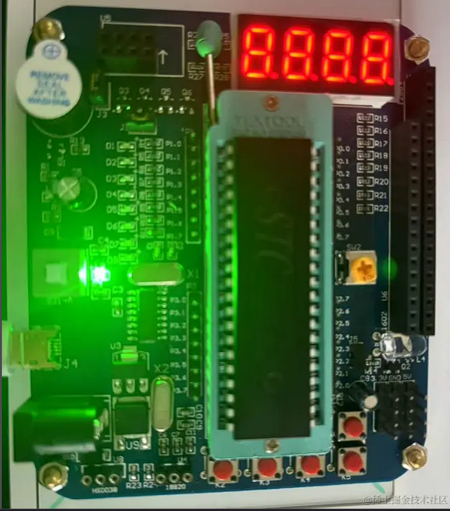
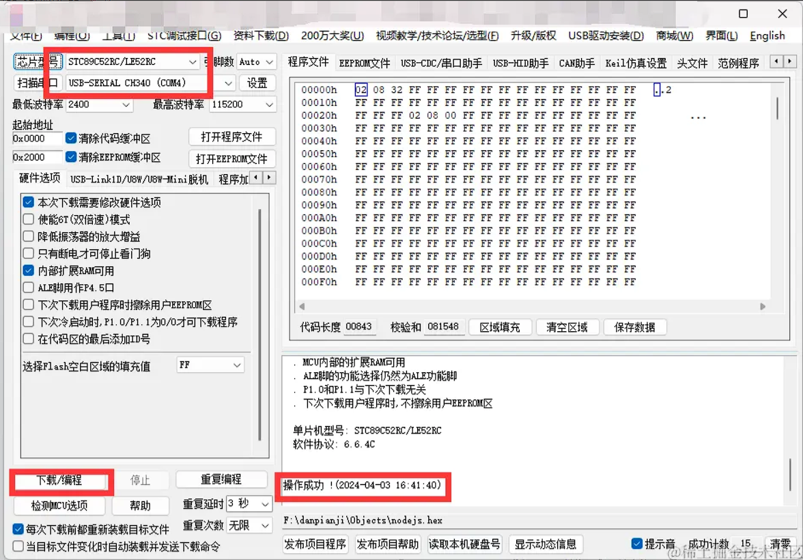

### 串口介绍

串口口技术是一种用于在计算机和外部设备之间进行数据传输的通信技术。它通过串行传输方式将数据逐位地发送和接收。

常见的串口设备有，扫描仪，打印机，传感器，控制器，采集器，电子秤等

### 51 单片机



### 需要安装的软件

1. Keil uVision5 编写单片机代码
2. stcai-isp 烧录单片机程序

# 单片机串口通讯编写

```c++
  #include <REGX51.H>
  #include <STDIO.h>
  sbit LED = P1^0; //
  void UART_Init() {
    SCON = 0x50; //工作方式
    PCON = 0x00; //32分频
    TMOD = 0x20; //计数器工作方式
    TH1 = 0xFD;
    TL1 = 0xFD;
    ES = 1; //接受中断
    EA = 1; //打开总中断
    TR1 = 1; //打开计数器
  }
  void main ()
  {
    UART_Init(); //调用初始化函数
    while(1);
  }

  void uart()interrupt 4
  {
  unsigned char date;
    date = SBUF; //接受数据
    if(date == '1'){
      LED = 0; //开灯
    }else if(date == '0'){
      LED = 1; //关灯
    }
    RI = 0;
  }

```

# 烧录至单片机



### node

### 安装 serialport

    npm install serialport

```js
import { SerialPort } from "serialport";

const serialPort = new SerialPort({
  path: "COM4", //单片机串口
  baudRate: 9600, //波特率
});

serialPort.on("data", () => {
  console.log("data"); //监听单片机的消息
});
let flag = 1;
setInterval(() => {
  serialPort.write(flag + ""); //跟单片机进行通讯 传值
  flag = Number(!flag);
  console.log(flag == 0 ? "开" : "关"); //进行开关的切换
}, 2000);
```
