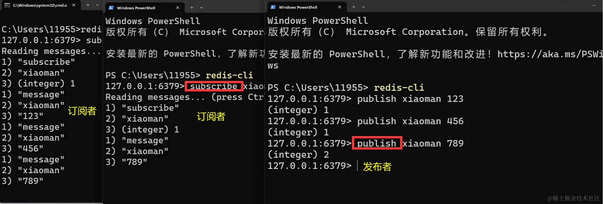
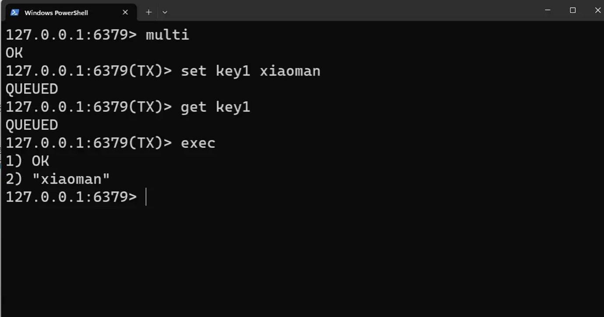

### redis 安装

## shell 添加 window 服务

redis-server.exe --service-install [配置文件] --loglevel verbose

```sh
# 添加
redis-server.exe --service-install redis.windows.conf --loglevel verbose
# 卸载
redis-server.exe --service-uninstall
# 启动
redis-server.exe --service-start
# 停止
redis-server.exe --service-stop
```

### Redis 提供两种持久化方式

## RDB（Redis Database）持久化

# redis.windows.conf 文件配置

    save  3600 1 // 3600秒内也就是一小时进行一次改动就会触发快照

# dump.rdb

    这个文件就是redis的快照文件，保存了redis的键值对，

# 适合做数据的备份

## AOF（Append Only File）持久化

appendonly yes //默认为 no

### redis 发布订阅

发布-订阅是一种消息传递模式，其中消息发布者（发布者）将消息发送到频道（channel），而订阅者（订阅者）可以订阅一个或多个频道以接收消息。
这种模式允许消息的解耦，发布者和订阅者之间可以独立操作，不需要直接交互。

在 Redis 中，发布-订阅模式通过以下命令进行操作：

1. PUBLISH 命令：用于将消息发布到指定的频道。语法为：PUBLISH channel message。例如，PUBLISH news "Hello, world!" 将消息"Hello, world!"发布到名为"news"的频道。
2. SUBSCRIBE 命令：用于订阅一个或多个频道。语法为：SUBSCRIBE channel [channel ...]。例如，SUBSCRIBE news sports 订阅了名为"news"和"sports"的频道。
3. UNSUBSCRIBE 命令：用于取消订阅一个或多个频道。语法为：UNSUBSCRIBE [channel [channel ...]]。例如，UNSUBSCRIBE news 取消订阅名为"news"的频道。
4. PSUBSCRIBE 命令：用于模式订阅一个或多个匹配的频道。语法为：PSUBSCRIBE pattern [pattern ...]。其中，pattern 可以包含通配符。例如，PSUBSCRIBE news.\* 订阅了以"news."开头的所有频道。
5. PUNSUBSCRIBE 命令：用于取消模式订阅一个或多个匹配的频道。语法为：PUNSUBSCRIBE [pattern [pattern ...]]。例如，PUNSUBSCRIBE news.\* 取消订阅以"news."开头的所有频道。
   

### redis 事务

Redis 支持事务（Transaction），它允许用户将多个命令打包在一起作为一个单元进行执行。
事务提供了一种原子性操作的机制，要么所有的命令都执行成功，要么所有的命令都不执行。

# Redis 的事务使用 MULTI、EXEC、WATCH 和 DISCARD 等命令来管理。

1. MULTI 命令：用于开启一个事务。在执行 MULTI 命令后，Redis 会将接下来的命令都添加到事务队列中，而不是立即执行。
2. EXEC 命令：用于执行事务中的所有命令。当执行 EXEC 命令时，Redis 会按照事务队列中的顺序执行所有的命令。执行结果以数组的形式返回给客户端。
3. WATCH 命令：用于对一个或多个键进行监视。如果在事务执行之前，被监视的键被修改了，事务将被中断，不会执行。
4. DISCARD 命令：用于取消事务。当执行 DISCARD 命令时，所有在事务队列中的命令都会被清空，事务被取消。

# 使用事务的基本流程如下：

1. 使用 MULTI 命令开启一个事务。
2. 将需要执行的命令添加到事务队列中。
3. 如果需要，使用 WATCH 命令监视键。
4. 执行 EXEC 命令执行事务。Redis 会按照队列中的顺序执行命令，并返回执行结果。
5. 根据返回结果判断事务执行是否成功。

事务中的命令在执行之前不会立即执行，而是在执行 EXEC 命令时才会被执行。这意味着事务期间的命令并不会阻塞其他客户端的操作，也不会中断其他客户端对键的读写操作。

需要注意的是，<code>Redis 的事务不支持回滚操作</code>。如果在事务执行期间发生错误，事务会继续执行，而不会回滚已执行的命令。因此，在使用 Redis 事务时，需要保证事务中的命令是幂等的，即多次执行命令的结果和一次执行的结果相同

```sh
# 连接Redis
redis-cli

# 开启事务
MULTI

# 添加命令到事务队列
SET key1 value1
GET key2

# 执行事务
EXEC

```



### redis 主从复制

## 新建 redis-6378.conf 文件

    bind 127.0.0.1 #ip地址
    port 6378 #端口号
    daemonize yes #守护线程静默运行
    replicaof 127.0.0.1 6379 #指定主服务器

## 启动从服务器

    ```sh
    redis-server ./redis-6378.conf 指定配置文件
    ```

## 打开从服务器 cli

    redis-cli -p 6378

## 注意从服务器是不允许写入的操作

## keys \*

    查看所有值
