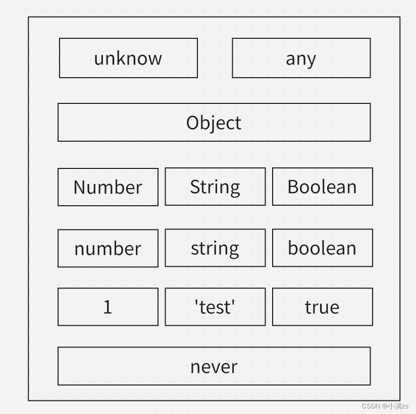

### 1.类型推论

```ts
let str = "string"; //string 类型

let str2; //any类型
```

### 2.类型别名

type 关键字（可以给一个类型定义一个名字）多用于复合类型

1. 定义类型别名

```ts
type str = string;

let s: str = "我是小满";

console.log(s);
```

2. 定义函数别名

```ts
type str = () => string;

let s: str = () => "我是小满";

console.log(s);
```

3. 定义联合类型别名

```ts
type str = string | number;

let s: str = 123;

let s2: str = "123";

console.log(s, s2);
```

4. 定义值的别名

```ts
type value = boolean | 0 | "213";

let s: value = true;
//变量s的值  只能是上面value定义的值
```

### type 和 interface 还是一些区别的 虽然都可以定义类型

1. interface 可以继承 type 只能通过 & 交叉类型合并

2. type 可以定义 联合类型 和 可以使用一些操作符 interface 不行

3. interface 遇到重名的会合并 type 不行

### type 高级用法

extends 包含
左边的值会作为右边值的子类型遵循图中上下的包含关系

```ts
type a = 1 extends number ? 1 : 0; //1

type a = 1 extends Number ? 1 : 0; //1

type a = 1 extends Object ? 1 : 0; //1

type a = 1 extends any ? 1 : 0; //1

type a = 1 extends unknow ? 1 : 0; //1

type a = 1 extends never ? 1 : 0; //0
```

