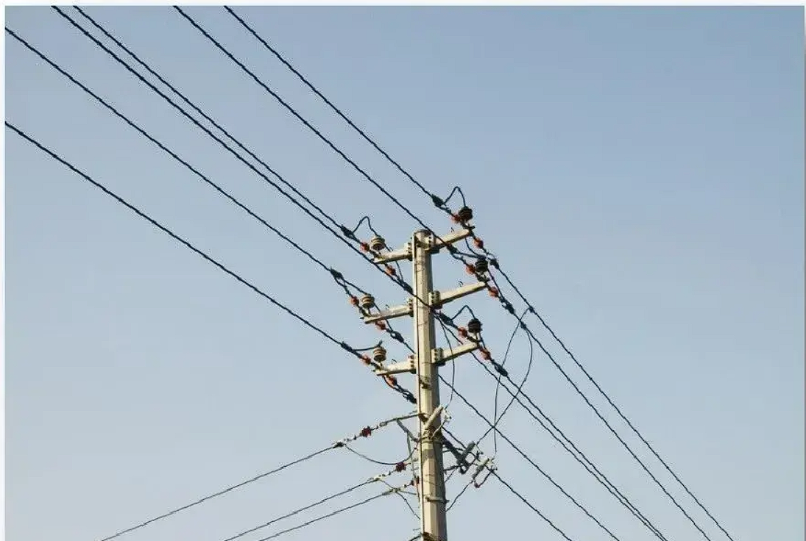
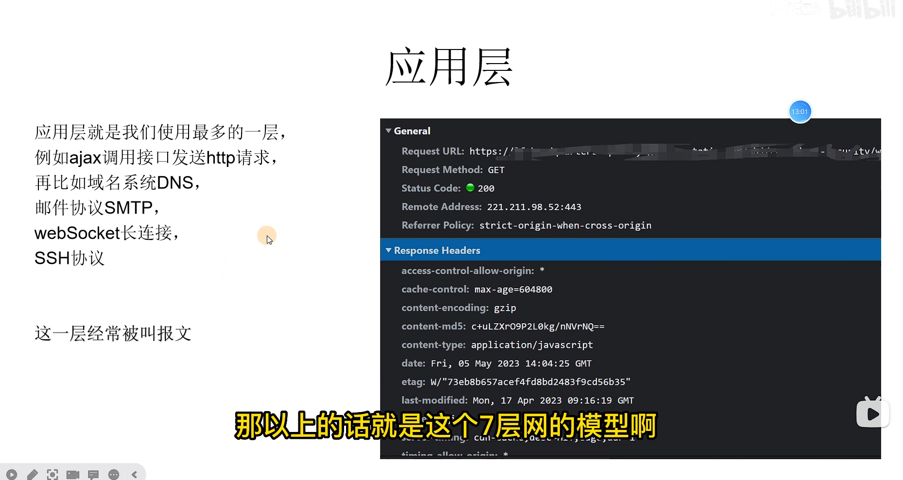

### OSI 7 层模型

## 1.物理层（二进制）

    物理层的设备 网卡，网线，集线器，中继器，调制解调器
    物理层信道：
      # 有线信道（明线）
        1.明线
          是指平行架设在电线杆上的架空线路。它本身是导电裸线或带绝缘层的导线。虽然它的传输损耗低，但是由于易受天气和环境的影响，对外界噪声干扰比较敏感，已经逐渐被电缆取代。
          
        2.对称电缆
          对称电缆是由多对双绞线组成的线缆
          images/对称电缆.png
        3.同轴电缆
          同轴线缆的应用范围极为广泛，同轴电缆能以低损耗的方式传输模拟信号和数字信号，适用于各种应用，其中常见的有电视广播系统、长途电话传输系统、计算机系统之间的短距离跳线以及局域网互联等
          images/同轴电缆.png
        4.光纤
          光导纤维是由玻璃或塑料制成的纤维，利用光在这些纤维中以全反射原理传输的光传导工具（全反射现象是光的折射的特殊现象，只有光从光密介质射向光疏介质并且入射角大于等于临界角时全反射 现象才会发生）
          比如：海市蜃楼

      # 无线信道
        以辐射无线电波为传输方式无线信道主要有地波传输，天波传输和视距传输 例如：卫星通讯，电台广播 wifi
        images/无线信道.png

    在这一层通过以上的方式，会获取他们对应的传送信号，电压，转换成010101010101（二进制）但是数据还未组织，仅作为原始的电气电压处理单位为bit

## 2.数据链路层（Mac 地址）

    建立逻辑连接、进行硬件地址寻址、差错校验等功能。（由底层网络定义协议）
    将比特组合成字节进而组合成帧，用MAC地址访问介质，错误发现但不能纠正。
    有了Mac地址之后就可以知道谁是接收者，谁是发送者，并且知道了数据的内容并且进行了分组。

    单位：数据帧
    将比特组成字节，字节组成帧再拼接上Mac地址

    交互使用交换机（物理交换机），通过跳点的方式进行交互

    Mac地址：每个网卡的唯一标识

    images/数据链路层.png

    那么他如何进行传播数据，他是进行广播的方式进行传输,在局域网内所有的计算机都能收到消息

## 3.网络层（IP）

网络层是最复杂的一层，在这一层就定义了我们的 IP，220.xxx.xxx.xxx。

该层控制数据链路层与传输层之间的信息转发，建立、维持和终止网络的连接。

具体地说，数据链路层的数据在这一层被转换为数据包，然后通过路径选择、分段组合、顺序、进/出路由等控制，将信息从一个网络设备传送到另一个网络设备

1. 寻址：对网络层而言使用 IP 地址来唯一标识互联网上的设备，网络层依靠 IP 地址进行相互通信（类似于数据链路层的 MAC 地址）

2. 路由：在同一个网络中的内部通信并不需要网络层设备，仅仅靠数据链路层就可以完成相互通信，对于不同的网络之间相互通信则必须借助路由器等三层设备。

## 4.传输层（端口；协议 TCP/UDP）

传输层定义我们的端口号，以及控流和校验

TCP 是面向连接的协议并且 TCP 是可靠的
因为 TCP 会进行三次握手四次挥手所以是可靠的，但是这样会降低速度

UDP 具有较好的实时性，效率比 TCP 高
UDP 是没有三次握手四次挥手所以不是可靠的，但是速度快；常用于直播、游戏

这一层经常被叫数据段

## 5.会话层

会话层，时在发送方和接收方之间进行通信时创建、维持、之后终止或断开连接的地方，与电话通话有点相似

会话层定义了一种机制，允许发送方和接收方启动或停止请求会话，以及当双发发生拥塞时仍能保持对话

会话层包含了一种称为检查点（Checkpoint）的机制来维持可靠会话。
检查点定义了一个最接近成功通信的点，并且定义了当发生内容丢失或者损坏时需要回滚以便回复丢失或者损坏的点，即断点下载的原理

这一层经常被叫报文

如：qq/微信，群聊或者单聊会建立会话 ID 来维护

## 6.表示层（解码）

做安全、压缩，也是程序在网络中的一个翻译官

1. 安全在你的数据发送之前进行加密，在接收者的表示层进行解密；
2. 表示层还会对图片文件等格式进行解码和编码 例如 JPEG、ASCII 图片时人类能读懂计算机需要转换成计算机能读懂的编码

这一层经常被叫报文

## 应用层

例如: ajax 调用接口发送 http 请求，域名系统 DNS，邮件协议 SMTP，webSocket 长连接，SSH 协议

这一层经常被叫报文

