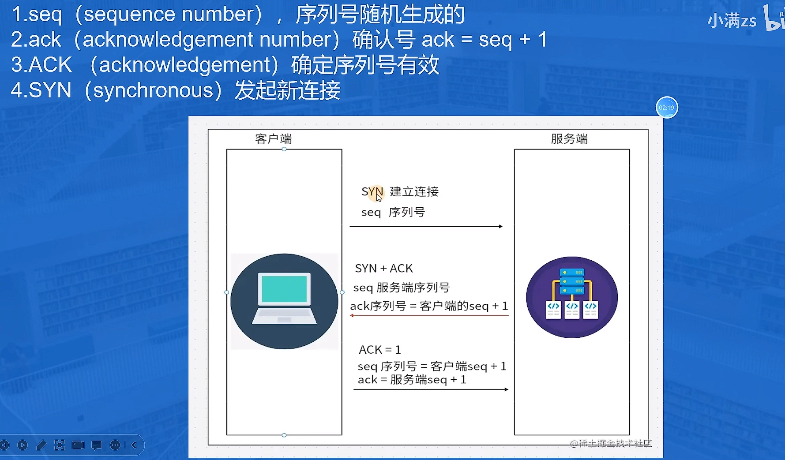
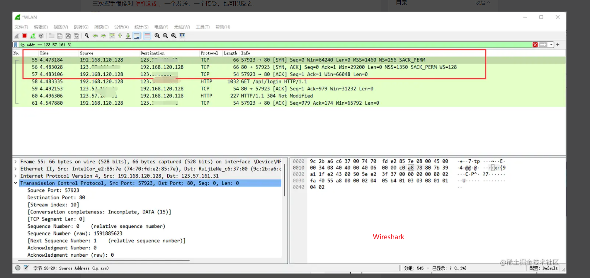

### 名词描述
1. seq（sequence number），序列号随机生成的
2. ack（acknowledgement number）确认号 ack = seq + 1
3. ACK （acknowledgement）确定序列号有效
4. SYN（synchronous）发起新连接
5. FIN （FINISH）完成

### 具体步骤讲解

1. 首先客户端会发送一个段这个段就是SYN报文，想跟服务端进行连接，并且会携带一个seq序列号，下次发送的数据序列号还会进行+1。

2. 服务端收到了SYN + seq 字段之后，服务端也会生成一个对应服务端seq序列号，这时候就会携带ACK确认号，表示之前的SYN 收到了，还会有一个小写的ack 把 客户端的seq + 1

3. 客户端收到服务端的响应之后会发送一个ACK确定序列号有效,并且还会发送seq注意这里的seq会通过算法计算出来是否跟服务端的ack值相等，然后会发送一个新的ack这里的ack是服务端的seq值+1，确保一切正常。

