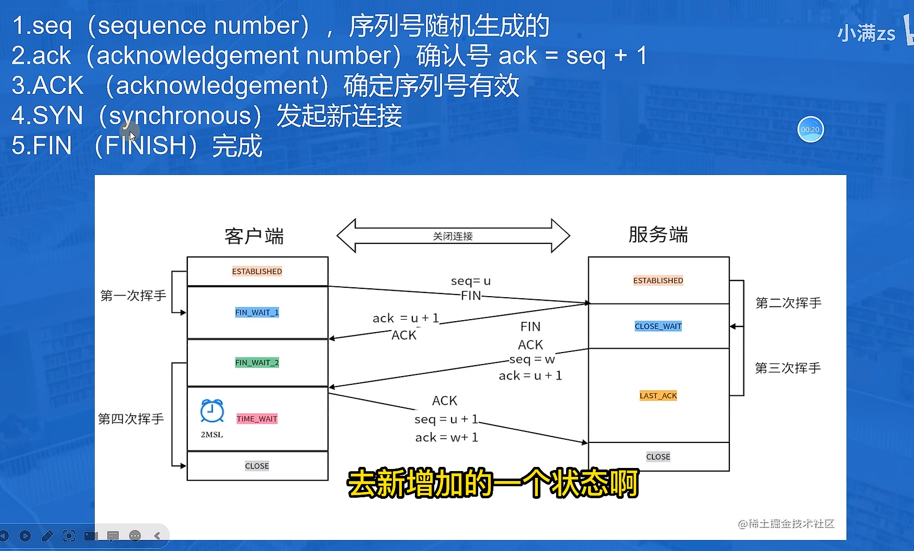
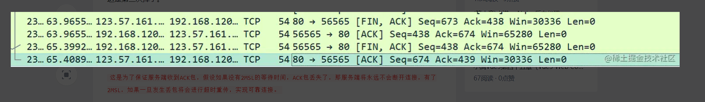

### 四次挥手

1. 第一次挥手
   断开连接服务端和客户端都可以主动发起我们拿客户端举例，客户端进行断开操作先发送 FIN 包生成客户端的 seq 序列号随后进入 wait1 状态 ,这是第一次挥手。
2. 第二次挥手
   服务端收到 FIN 包表示自己进入了关闭等待状态，然后向客户端使用 ack 验证，验证成功打上 ACK 标记，随后生成服务端的 seq 值发送给客户端，这是第二次挥手，服务端此时还可以发送未完成的数据。
   如果还有别的任务还会再进行处理
3. 第三次挥手
   等待服务端所有任务操作完成之后服务端开始进入最后确认状态，向客户端发送 FIN 包,并且验证 ack，使用客户端第一次的 seq + 1 去验证，验证成功打上 ACK 标记，并且生成一个新的序列号 seq 发送给客户端，这是第三次挥手。
4. 第四次挥手
客户端收到之后进入超时等待状态 2MSL（1-4 分钟），经过等到后客户端关闭连接，而服务端收到信息验证完成 ack 成功之后打上 ACk 标记随后将关闭连接。

### 为什么需要超时等待时间?
这是为了保证服务端收到 ACK 包，假设如果没有 2MSL 的等待时间，ACK 包丢失了，那服务端将永远不会断开连接，有了 2MSL，如果一旦发生丢包将会进行超时重传，实现可靠连接。
