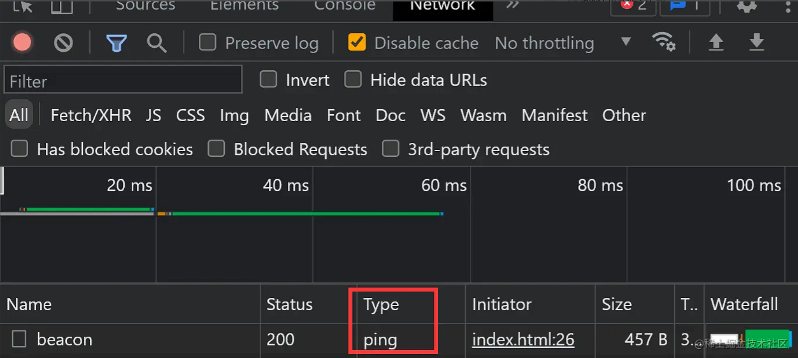

### 使用  navigator.sendBeacon  实现高效的数据上报

在 web 开发中，我们经常需要将用户行为或性能数据上报到服务器。为了不影响用户体验，开发者通常会在页面卸载时进行数据上报。然而，传统的数据上报方式，如  XMLHttpRequest  或  Fetch API，容易受到页面卸载过程中的阻塞，导致数据丢失。为了解决这个问题，navigator.sendBeacon API 被引入，它可以在页面卸载时安全、可靠地发送数据。

### navigator.sendBeacon 对比 Ajax fetch

1. 优点

不受页面卸载过程的影响，确保数据可靠发送。
异步执行，不阻塞页面关闭或跳转。
能够发送跨域请求。// html5 的 ping 请求

2. 缺点

fetch 和 ajax 都可以发送任意请求 而 sendBeacon 只能发送 POST
fetch 和 ajax 可以传输任意字节数据 而 sendBeacon 只能传送少量数据（64KB 以内）
fetch 和 ajax 可以定义任意请求头 而 sendBeacon 无法自定义请求头
sendBeacon 只能传输 ArrayBuffer、ArrayBufferView、Blob、DOMString、FormData  或  URLSearchParams  类型的数据
如果处于危险的网络环境(公共网络)，或者开启了广告屏蔽插件 此请求将无效

### 应用场景

1. 发送心跳包：可以使用  navigator.sendBeacon  发送心跳包，以保持与服务器的长连接，避免因为长时间没有网络请求而导致连接被关闭。
2. 埋点：可以使用  navigator.sendBeacon  在页面关闭或卸载时记录用户在线时间，pv uv，以及错误日志上报 按钮点击次数。
3. 发送用户反馈：可以使用  navigator.sendBeacon  发送用户反馈信息，如用户意见、bug 报告等，以便进行产品优化和改进

### 其他注意事项 type
ping请求 是html5 新增的 并且是sendBeacon 特有的 ping 请求 只能携带少量数据，并且不需要等待服务端响应，因此非常适合做埋点统计，以及日志统计相关功能。

### 在网站分析和流量统计中，PV 和 UV 是两个常用的指标：

1. PV (Page Views)：

简称：页面浏览量
含义：指页面被查看的次数，即用户对网站中各个页面的访问次数的总和。每次用户加载或刷新页面都会被计为一次 PV。
用途：PV 用来衡量网站的受欢迎程度和页面的浏览量，是网站流量的重要指标之一。

2. UV (Unique Visitors)：

简称：独立访客
含义：指访问网站的不同 IP 地址的人数。在一个统计周期（通常是一天）内，一个独立访客无论访问网站多少次，都只计算为一个 UV。
用途：UV 用来衡量有多少独立的用户访问了网站，反映了网站的受欢迎程度和用户覆盖范围。
这两个指标常用于网站分析工具，比如 Google Analytics，用于评估网站的流量和用户参与度。
